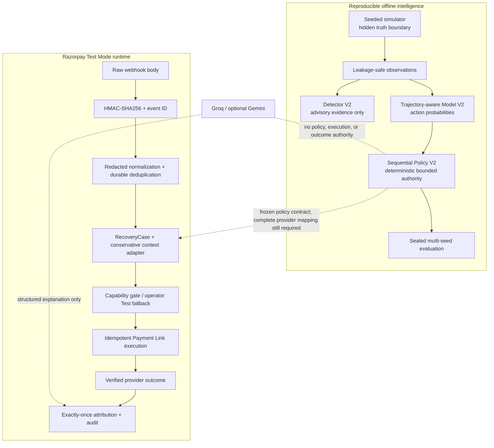

# RecoverIQ Final Submission Readiness Report

> This is the pre-cleanup audit that identified submission blockers. The Git hygiene, current-state copy, checked-in Groq default, namespaced model diagnostic, and evidence-packaging blockers were addressed in commit `cc47228`. See `FINAL_CLEANUP_REPORT.md` for the final verified state. Product and production-readiness limitations remain intentionally documented.

Audit date: 2026-08-23 (Asia/Calcutta)

Repository: `C:\Users\azureuser\Desktop\RecoveryIQ`

Branch: `main`

Audited HEAD: `f0f5df2` (`feat: integrate Razorpay Test Mode recovery execution`)

Audit scope: architecture, security, LLM authority, Razorpay safety, ML reproducibility, detector methodology, policy evidence, testing, documentation, and demo readiness

Implementation changes made by this audit: none

## Executive verdict

**Overall submission status: CONDITIONALLY READY — do not submit the current working tree as-is.**

The engineering core is strong and evidence-backed. All 181 Python tests pass, all lint and strict type-check gates pass, the frontend production build passes, dependency audits found no known vulnerabilities, local API health/status checks pass, tracked secrets were not found, frozen artifacts are unchanged, and overall-final seeds remain untouched.

The repository is not packaging-ready because the current Phase 7 explanation-provider work and the sanitized Razorpay Phase 7.5 evidence are not committed. Submission-facing documentation, the frontend, and the checked-in Groq default also contain stale information. These do not invalidate the underlying model, policy, or Test Mode evidence, but they make the current repository internally inconsistent and could cause a reviewer or a clean-clone demo to see a materially older product story.

| Area | Status | Submission interpretation |
|---|---|---|
| Core architecture | PASS | Clear separation of evidence, deterministic authority, execution, attribution, and explanation |
| Runtime completeness | CONDITIONAL | Test Mode runtime is implemented; frozen Model V2/Policy V2 are not wired to complete provider-history scoring |
| Security boundaries | PASS WITH LIMITATIONS | Strong Test Mode and webhook controls; no operator/tenant API authentication yet |
| LLM authority isolation | PASS | Structured explanation only, strict local validation, deterministic fallback, no execution authority |
| Razorpay execution safety | PASS FOR TEST MODE | One real Payment Link E2E is evidenced; Live Mode is absent |
| ML reproducibility | PASS | Disjoint seed groups, frozen schemas/models/calibrators, one-time held-out guards |
| Detector methodology | PASS AS RESEARCH; FAIL AS AUTHORITY | Failed hard-policy gate is preserved and detector remains advisory-only |
| Policy validation | PASS | All preregistered claims pass with zero policy violations; negative ERV-vs-probability result is retained |
| Automated validation | PASS | 181 tests plus lint, typing, build, and dependency audit pass |
| Documentation | CONDITIONAL | Deep methodology is strong; top-level status and UI copy are stale |
| Demo readiness | CONDITIONAL | API/demo evidence is ready; current frontend is only a Phase 1 health shell |
| Git/submission packaging | FAIL | Working tree is dirty and contains critical uncommitted files |

## What is built

RecoverIQ is a bounded revenue-recovery control plane for recurring-payment failures. The repository contains:

- a FastAPI, SQLAlchemy 2, Alembic, Celery, SQLite/PostgreSQL-compatible backend foundation;
- a deterministic, event-driven recurring-payment simulator with hidden ground truth and leakage-safe observations;
- fixed-retry and reminder-plus-retry baselines evaluated with paired semantic random draws;
- Degradation Detector V1 and a tiered sequential Detector V2 with explicit `WATCH` and `CONFIRMED` evidence;
- action-conditioned Recovery Model V1 and trajectory-aware, health-free Recovery Model V2;
- exact-minor-unit expected recovery value scoring and deterministic policy rules;
- bounded Sequential Policy V2, which replans for no more than three interventions inside 48 hours;
- frozen model, calibration, detector, policy, trace, and validation artifacts;
- a Razorpay Test Mode execution boundary for Standard Payment Links and signed webhooks;
- separate persisted decisions, execution plans, executions, outcomes, attributions, and audit events;
- Groq, optional Gemini, fake, and deterministic explanation providers behind an `ExplanationProvider` protocol;
- strict Pydantic explanation output validation and failure isolation;
- a Next.js operational shell that currently shows API/runtime health only;
- methodology, safety, evaluation, Razorpay runbook, and sanitized real Test Mode evidence documents.

## Why it solves the problem

Naive recovery systems repeat a static retry schedule even when the failure context, prior interventions, customer-contact budget, or expected value has changed. RecoverIQ instead treats recovery as a bounded sequential decision problem:

1. observe only information available at the current time;
2. estimate action-level recovery probabilities from logged, leakage-safe evidence;
3. calculate incremental expected recovery value in integer minor units;
4. apply deterministic feasibility, safety, support, quiet-hours, retry, contact, horizon, and attribution rules;
5. execute only explicitly capable Test Mode actions;
6. replan after observed outcomes or stop/refer to a human;
7. attribute recovery exactly once from a verified provider outcome;
8. allow an LLM to explain the already-computed trace without granting it decision or payment authority.

This design improves adaptability without making autonomy unbounded or opaque. It also preserves negative findings: payment-health features did not improve the primary recovery model, Detector V2 did not qualify as a hard safety signal, and the probability-only policy slightly outperformed ERV Policy V2 on gross recovery in sealed validation.

## Technical architecture

The offline intelligence and runtime execution layers intentionally do not pretend to be more integrated than they are. The first external provider event lacks the complete historical and categorical feature mapping required by frozen Model V2, so `RazorpayContextAdapter` records `HUMAN_REVIEW / INSUFFICIENT_CONTEXT` rather than fabricating values. The one real Test Mode Payment Link used an explicitly labelled operator fallback through the normal execution and attribution domain path.

## Architecture completeness review

### Strengths

- Domain boundaries separate ingestion, evidence, prediction, policy, execution, outcome, attribution, explanation, and audit.
- The simulator does not import API, frontend, LLM, or Razorpay code.
- Hidden ground truth is inaccessible to policy/model feature construction and joins only after frozen predictions for evaluation.
- The runtime distinguishes a recommendation, a policy decision, an execution capability, a provider side effect, and a verified outcome.
- SQLite/eager Celery provide a practical local mode without changing the PostgreSQL/Redis production-shaped boundaries.
- Failure paths explicitly support human review, stop, unknown provider outcome, reconciliation, duplicate receipt, and out-of-order delivery.

### Incomplete integration

- Frozen Recovery Model V2 and Sequential Policy V2 are validated offline but are not yet driven by a complete real-provider history/category adapter in the API.
- The explanation-provider factory is implemented and tested but is not exposed through a product API route or invoked by a recovery workflow.
- The frontend is an API-health shell, not a recovery queue, decision-trace viewer, evidence dashboard, or attribution demo.
- PostgreSQL, Redis, multi-worker concurrency, deployment, authentication, and production observability are not demonstrated in this environment.

## Security boundaries

### Verified controls

- `.env` is ignored by `.gitignore`.
- Five locally configured credential fields were present during the audit, but none of their values appeared in tracked files or `git diff`.
- Provider-shaped secret scanning found zero matches in the current tracked tree, all nine commits, and the working tree excluding ignored `.env` and dependency/build directories.
- Checked-in secret assignments are empty placeholders or explicit synthetic test fixtures.
- Pydantic `SecretStr` protects Razorpay, Gemini, and Groq values from normal representation/serialization.
- `RAZORPAY_MODE` accepts only `test`; a non-`rzp_test_` key ID is rejected.
- health and integration-status responses expose presence/capability booleans, not credential values.
- Razorpay webhook verification uses HMAC-SHA256 over exact raw bytes and constant-time `compare_digest`.
- Missing signatures, invalid signatures, missing/oversized event IDs, invalid JSON, and bodies above 1 MiB are rejected before processing.
- Raw provider bodies and signature values are not retained; a SHA-256 digest and redacted allowlisted payload are persisted.
- Database uniqueness enforces provider-event deduplication and exactly-once outcome/attribution constraints.
- Payment Link creation disables partial payment, notifications, and reminders and uses a unique bounded reference.
- Ambiguous create outcomes become `UNKNOWN` and must reconcile by provider ID/reference; replacement creation remains blocked.

### Security limitations

- Recovery-case, audit, integration-status, and operator Test Payment Link endpoints have no application authentication, merchant authorization, or role checks. They are suitable only for a controlled local/Test Mode demo, not a publicly exposed production service.
- There is no explicit API rate limiter, webhook source-IP policy, WAF policy, or abuse-control layer in the repository.
- LLM provider methods accept a general evidence mapping and serialize it directly. The design document calls for an allowlist serializer, but that data-minimization boundary is not yet enforced in code.
- Secret scanning is pattern-based and exact-value-based, not a substitute for a dedicated entropy/history scanner in CI.
- SQLite does not prove transaction isolation under multiple workers. Exactly-once behavior should be revalidated on PostgreSQL with concurrent deliveries.

## LLM authority isolation

**Status: PASS.**

- `ExplanationProvider` exposes only health checking, decision-trace explanation, and recovery-case explanation.
- `DecisionExplanation` contains only `summary`, `factors`, `confidence`, and `limitations`; extra fields are forbidden.
- The Groq system instruction explicitly prohibits choosing/recommending actions, changing policy/probabilities, inferring payment outcomes, or authorizing execution.
- Groq JSON output is locally revalidated with Pydantic. Invalid, missing, timed-out, network-failed, or authentication-failed responses fall back to a deterministic local explanation.
- Explanation failures do not interrupt ingestion, policy, execution, webhook processing, outcome recording, or attribution.
- Tests reject an attempted authoritative `selected_action` response and verify that the explanation layer imports neither Razorpay nor execution/model-policy authority.
- The latest explicit operator validation authenticated against Groq, found `openai/gpt-oss-120b`, completed one live structured explanation request, and passed Pydantic and authority-boundary checks. This final audit did not issue another provider request.

Remaining LLM issues:

- checked-in `Settings.groq_model` and `.env.example` still default to the unavailable `llama-3.3-70b-versatile`; only ignored local `.env` selects the verified model;
- the existing single-model `health_check()` URL-encodes the slash in a namespaced Groq model ID and returns 404, although model listing and generation succeed;
- there is no API/workflow integration or persisted sanitized live-Groq evidence report;
- prompt evidence lacks a code-enforced field allowlist.

## Razorpay execution safety

**Status: PASS for the implemented Test Mode boundary. Live Mode is not implemented.**

Only `CREATE_PAYMENT_LINK` has `REAL_TEST_EXECUTION` capability. Retries remain internal schedules, messaging/method-change actions remain recommendations, and hidden-oracle actions remain simulation-only. Operator execution requires `EXECUTION_ENVIRONMENT=RAZORPAY_TEST`, provider mode `test`, configured Test credentials, INR, a nonterminal case, and no existing or unknown execution requiring reconciliation.

The sanitized Phase 7.5 evidence records one genuine Test Mode flow:

| Evidence | Result |
|---|---:|
| Real Razorpay API requests | 3: one create and two fetches of the same link |
| Test Mode resources created | 1 non-partial Payment Link |
| Amount | INR 1.00 (`100` minor units) |
| Real provider webhooks | 1 `payment_link.paid` |
| Local duplicate replays | 1 |
| Signature validation | PASS |
| Event-ID deduplication | PASS |
| Link/reference/amount/currency match | PASS |
| ExternalOutcome | Exactly 1 |
| RecoveryAttribution | Exactly 1 |
| RecoveryCase recovered transition | Exactly 1 |
| Duplicate replay side effects | None |

The evidence does not prove Subscription creation/charge handling, Live Mode, production revenue lift, or that a Payment Link repairs the original subscription mandate.

## ML/model reproducibility

**Status: PASS.**

- Seed groups are preregistered and disjoint for training, development, calibration, held-out evaluation, policy validation, and overall-final evaluation.
- Overall-final seeds `20261101`–`20261120` remain recorded as untouched and were not run by this audit.
- Model V2 uses a frozen `2.0` feature schema with SHA-256 `d3e87a20f104fac0b860ae71a2c583a3a922209b5ef10b0eac5c7f1213601cc5`.
- Primary LightGBM and logistic models consume the same no-health boundary; selection and calibration criteria were preregistered.
- Model and calibrator files have recorded SHA-256 digests; tests verify artifact integrity and refuse silent held-out reruns.
- Sequential logged actions have exact propensities, one current-action outcome, and no unselected counterfactual labels.
- Semantic keyed randomness keeps equivalent action outcomes stable across policy naming, logging, and candidate-order changes.
- No simulator source, detector source, model/policy package, tracked artifact, or seed configuration has a working-tree change.

### Model V2 evidence

The one-time held-out evaluation covered 62,918 decisions across 27,451 episodes and ran once.

| Metric | Calibrated LightGBM | Calibrated logistic baseline |
|---|---:|---:|
| Brier score | 0.151320 | 0.176440 |
| Log loss | 0.456991 | 0.534610 |
| ECE | 0.004226 | 0.005272 |
| ROC-AUC | 0.793268 | 0.670779 |
| PR-AUC | 0.531004 | 0.404170 |

Decision-index pairwise ranking accuracy remained 0.897927, 0.864327, and 0.851827 for decisions 1–3. Every registered quality-gate check passed. The primary model deliberately excludes payment-health/Detector V2 features because previous held-out comparisons did not support their inclusion.

## Detector methodology

**Status: methodologically credible advisory evidence; not safe for policy authority.**

Detector V2 uses predictable pre-event empirical-Bayes baselines, three one-sided likelihood/CUSUM alternatives, frozen baselines while an episode is active, local minimum-volume gates, failure-reason Jensen–Shannon evidence, hysteresis, recovery likelihood, cooldowns, and separate issuer/method/global scopes. Hidden incident truth is joined only after replay.

The preregistered validation hard-policy gate failed:

- confirmed precision: 3.70%, below the required 70%;
- false confirmations: 0.005380 per issuer-scope-day, above the maximum 0.005;
- confirmed non-vacuity: 108 episodes, passing the minimum-count condition;
- high-evidence confirmed recall: 7.14%;
- 104 false confirmed issuer episodes exposed 824 observable failed payments in their confirmed-to-resolved windows.

RecoverIQ correctly preserves this failure. `WATCH` and `CONFIRMED` remain advisory-only, the hard-policy-passed field remains false, and primary Model V2 excludes detector/payment-health fields. No thresholds were retuned after validation.

## Policy validation evidence

**Status: PASS, with an honestly preserved negative comparator result.**

The frozen policy is version `2.0.0`, config hash `ce7712b1ee4e800d54a875eb65a7bc826680e59faa465b54cbc1db7472010b25`, and was evaluated once on 27,406 identical starting episodes per strategy.

| Strategy | Recovery rate | Recovered episodes | Retries | Contacts | Violations |
|---|---:|---:|---:|---:|---:|
| Fixed Retry | 41.74% | 11,440 | 48,103 | 0 | 0 |
| Reminder + Retry | 53.09% | 14,549 | 38,896 | 26,037 | 0 |
| Simple observable rule | 64.60% | 17,704 | 30,819 | 24,493 | 0 |
| Probability-only sequential | 76.18% | 20,878 | 28,610 | 20,010 | 0 |
| **RecoverIQ Sequential ERV V2** | **75.97%** | **20,821** | **28,829** | **19,519** | **0** |
| Greedy hidden oracle | 78.10% | 21,405 | 25,543 | 20,588 | 0 |

All preregistered safety, recovery, strong-recovery, ML-personalization, and friction-efficiency claims passed. RecoverIQ materially exceeded Reminder + Retry and the simple observable rule while using fewer contacts than Reminder + Retry. It did not beat the probability-only policy on recovery or net value; it used 491 fewer contacts but recovered 57 fewer episodes. That negative result is retained rather than reframed.

## Test coverage and quality gates

| Gate | Result |
|---|---|
| API pytest | PASS — 53/53 |
| Simulator/detector/model/policy pytest | PASS — 128/128 |
| Total Python tests | PASS — 181/181 |
| API Ruff | PASS |
| Simulator Ruff | PASS |
| API strict mypy | PASS — 48 source files |
| Full simulator ecosystem strict mypy | PASS — 119 source files |
| Frontend ESLint | PASS |
| Frontend TypeScript | PASS |
| Frontend production build | PASS — Next.js 16.3.2 |
| API dependency audit | PASS — 77 installed dependencies, 0 known findings |
| Simulator dependency audit | PASS — 38 installed dependencies, 0 known findings |
| Frontend production dependency audit | PASS — 0 findings |
| Local `GET /health` | PASS — HTTP 200 / healthy |
| Local Razorpay status endpoint | PASS — HTTP 200 / Test Mode / Live unavailable |

Test breadth includes leakage boundaries, counterfactual fairness, deterministic draws, seed guards, frozen hashes, held-out rerun refusal, model schemas and calibration gates, detector lifecycle and safety methodology, policy limits/abstention/attribution, raw-body webhook HMAC behavior, event deduplication, Payment Link idempotency/reconciliation, amount/reference checks, exactly-once attribution, LLM schema rejection, fallback behavior, and authority isolation.

Coverage limitations:

- no line or branch coverage percentage is produced;
- no frontend unit, browser E2E, accessibility, or visual-regression test exists;
- PostgreSQL, Redis, non-eager Celery, multi-worker races, and migration rollback are not exercised against real services here;
- ordinary CI does not call Groq or Razorpay, by design;
- only one real Razorpay Test Mode Payment Link flow is evidenced;
- 34 non-failing `joblib`/NumPy deprecation warnings appear in simulator tests;
- CI's simulator mypy command covers `recoveriq_simulator` and tests, while this audit additionally checked every detector/model/policy package locally.

## Documentation quality

### Strong material

- Architecture, simulator, detector, model, policy, safety, and evaluation documents state methodology, gates, seeds, evidence boundaries, and limitations in detail.
- Frozen reports include machine-readable JSON plus concise Markdown summaries.
- The Razorpay integration document and beginner-oriented Test Mode runbook clearly distinguish alternate Payment Link recovery from subscription repair.
- The Phase 7.5 evidence is sanitized and reports exact request/resource/webhook counts and exactly-once proof.
- Failure logs preserve genuine engineering failures and corrective actions rather than presenting a frictionless narrative.

### Submission-facing inconsistencies

- `README.md` still says Razorpay is offline-only and explicitly says no genuine Test Mode API/webhook E2E is claimed, contradicting the later Phase 7.5 evidence.
- `docs/ARCHITECTURE.md` still presents Gemini as future enrichment and calls Razorpay offline-verified.
- the frontend says “Phase 1,” “Gemini explains,” “no model,” and “no live payment integration is active” despite completed later phases and Groq as the configured provider;
- `.env.example` and the typed Groq default name a model that Groq reports unavailable;
- `docs/GEMINI_DESIGN.md` describes the generalized explanation layer accurately but retains a provider-specific filename;
- the sanitized Phase 7.5 evidence file is untracked and would be absent from a commit-based submission.

## Demo readiness and recommended flow

**Demo status: CONDITIONAL.** The API and evidence flow are demonstrable; the frontend does not represent the completed system.

Recommended submission demo, using existing artifacts and the already-created Test Mode case only:

1. State the safety thesis: model/detector outputs are evidence, deterministic policy is authority, and Razorpay outcomes are financial truth.
2. Start the API and show `GET /health` returning healthy, then show the Razorpay status endpoint returning `RAZORPAY_TEST`, provider mode `test`, and `live_mode_available=false`.
3. Show the simulator’s observable/hidden-truth boundary and semantic keyed randomness.
4. Show the Model V2 held-out report and explain why health features were excluded.
5. Show Detector V2's failed hard-policy gate and advisory-only enforcement.
6. Show the Sequential Policy V2 validation table, emphasizing bounded three-action replanning, zero violations, baseline lift, and the negative ERV-vs-probability result.
7. Open the existing RecoveryCase/audit trail or use only the sanitized Phase 7.5 evidence. Do not create another Payment Link.
8. Walk through signature validation, event deduplication, exact amount/reference matching, ExternalOutcome, exactly-one attribution, and exactly-one recovered transition.
9. Show a synthetic decision explanation or deterministic fallback and point out that its schema cannot contain an action or execution command.
10. Close with limitations: synthetic model/policy evidence, one Test Mode Payment Link, no Subscription E2E, no Live Mode, detector advisory only, and no production deployment claim.

Do not make the current frontend the centerpiece. It is useful only to show backend health until its phase/provider copy and operational views are updated. The previous public tunnel was not revalidated by this audit and should not be claimed active without a fresh operator check.

## Innovation points

1. **Causal/evaluation stability through semantic randomness.** Equivalent actions share semantic-keyed draws, preventing policy ordering or logging changes from altering counterfactual outcomes.
2. **Sequential action attribution.** Each logged row owns only the current action's outcome before the next decision; later recovery cannot relabel an earlier failed action.
3. **Evidence-tier detector governance.** A failed held-out safety gate automatically keeps even `CONFIRMED` degradation advisory rather than allowing post-hoc threshold tuning.
4. **Trajectory-aware, calibrated action prediction.** Model V2 scores feasible actions using only observable past episode state and retains strong decision-2/3 ranking support.
5. **Bounded economic policy with abstention.** Exact minor-unit ERV is subordinate to deterministic feasibility/support rules, three-action/48-hour budgets, STOP, and HUMAN_REVIEW.
6. **Capability-separated execution.** A selected policy label is not automatically a provider operation; each action maps to an explicit execution capability.
7. **Unknown-outcome-safe Payment Link creation.** Ambiguous transport failures reconcile the same unique execution instead of issuing a replacement.
8. **Exactly-once revenue attribution.** Provider event, outcome, execution, case, and payment uniqueness constraints combine with semantic validation before recovery is recorded.
9. **LLM enrichment without authority.** Remote models are optional, schema-bound, locally validated, and replaceable by a deterministic fallback without affecting recovery.
10. **Honest negative-result preservation.** Health features, detector authority, and ERV-vs-probability comparisons are reported without retroactive reframing.

## Limitations and remaining risks

| Priority | Risk | Consequence | Required disposition before production or strong submission claim |
|---|---|---|---|
| BLOCKER | Dirty working tree with critical uncommitted Phase 7/evidence files | Commit/archive submission may omit Groq and real E2E evidence | Review intended diff, include the report/evidence, commit, and rerun CI on the exact submission commit |
| HIGH | Stale README, architecture, UI, and Groq defaults | Reviewers and clean-clone demos receive contradictory or failing configuration | Align submission narrative and verified model configuration |
| HIGH | No API authentication/authorization | Operator and audit endpoints are unsafe on a public production host | Add authenticated merchant/operator boundaries before any public deployment |
| HIGH | Frozen Model V2/Policy V2 lack complete live-provider feature mapping | Runtime first-event behavior is conservative human review, not adaptive online policy execution | Build and validate a leakage-safe provider-history adapter without changing frozen artifacts |
| HIGH | LLM input has no enforced allowlist | A caller could accidentally send sensitive fields to a remote provider | Add an explicit minimal serializer and egress tests before production enrichment |
| MEDIUM | Groq checked-in default and `health_check()` do not support the verified namespaced model cleanly | Fresh configuration can fall back or report false unavailability | Update configuration/example and use a namespaced-ID-safe availability diagnostic |
| MEDIUM | PostgreSQL/Redis/concurrency not exercised | SQLite exactly-once results may not expose real worker races | Add integration tests with concurrent webhook deliveries and workers |
| MEDIUM | Detector V2 hard-policy gate failed | Treating outage evidence as authority would create unsafe false positives | Preserve advisory-only behavior unless a new preregistered generation passes independently |
| MEDIUM | Only one Payment Link E2E; no Subscription E2E | Provider coverage is narrow | Add separate Test Mode subscription verification without overstating Payment Link semantics |
| MEDIUM | No quantitative code coverage or frontend E2E | Important untested paths may remain despite broad unit tests | Add coverage reporting and a browser/API demo smoke |
| LOW | Simulator test deprecation warnings | Future NumPy/joblib upgrades may break artifact loading tests | Pin/upgrade deliberately and verify artifact compatibility |
| LOW | Public tunnel not revalidated | Live webhook demo URL may be unavailable | Check immediately before demo; expose only the required Test Mode API surface |

## Git and artifact integrity

Before this report was added, Git showed 13 modified tracked files and five untracked files. The untracked files were the Groq provider/factory/resilience implementation, its tests, and the Razorpay Phase 7.5 evidence. This report adds one more untracked file. The repository is therefore intentionally reported as dirty, not clean.

No status or diff entry exists under `artifacts/` or `simulator/`. Frozen detector/model/calibration/policy assets are unchanged relative to HEAD, and test-enforced hashes pass. No final-seed source/config or artifact path differs from HEAD. This audit did not execute any overall-final seed command.

## Final submission gate

RecoverIQ's **technical core is ready for submission review**, but the **current repository package is not ready to submit unchanged**. A release candidate should be declared only after:

1. all intended Phase 7 and Phase 7.5 changes are reviewed and committed;
2. submission-facing status, provider configuration, architecture, and frontend copy are made internally consistent;
3. no secret is staged, and `.env` remains ignored;
4. CI runs successfully on the exact clean commit;
5. protected artifact and final-seed hashes/status are rechecked;
6. the existing no-new-resource demo is rehearsed from a clean clone;
7. claims remain limited to deterministic synthetic evidence, one real Razorpay Test Mode Payment Link E2E, and explanation-only LLM validation.

With those packaging and narrative issues resolved, RecoverIQ presents a credible, unusually rigorous submission: adaptive recovery with bounded authority, leakage-safe evaluation, preserved negative results, Test Mode execution safety, exactly-once attribution, and optional non-authoritative LLM explanations.
