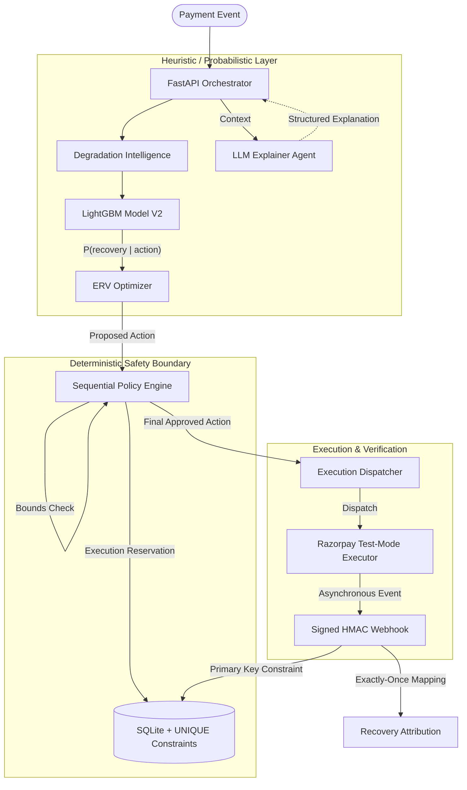

# RecoveryIQ

**Autonomous Revenue Recovery Control Plane for Razorpay-style payment workflows**

RecoveryIQ detects revenue at risk, estimates action-conditioned recovery probability, optimizes interventions using Expected Recovery Value (ERV), and executes supported safe recovery workflows under strict deterministic boundaries.

> **Disclaimer**: All evaluation results reported here are simulated outputs and do not represent Razorpay production revenue. Test Mode integrations use simulated money only.

---

## RecoveryIQ in 60 Seconds

RecoveryIQ is an autonomous revenue recovery control plane that solves the problem of naive payment retries burning contact limits and ignoring issuer degradation. It uses event-driven failure detection and action-conditioned LightGBM V2 models to evaluate recovery probability under each candidate action. The system optimizes for Expected Recovery Value (ERV), balancing probability, recoverable revenue, intervention cost, and customer friction. 

Crucially, all AI recommendations pass through a deterministic Sequential Policy V2 that enforces frozen limits on retries, contacts, and horizons. When an action is authorized, it executes via Razorpay Test Mode, processing asynchronous signed HMAC webhooks, applying strict provider-event deduplication, and mapping exactly-once local outcome and recovery attribution semantics. The LLM acts entirely in an explanation-only capacity, completely isolated from financial execution authority.

---

## Explore RecoveryIQ (Deep Dive Documentation)

| Document | Why it matters |
| --- | --- |
| [Architecture](docs/ARCHITECTURE.md) | In-depth breakdown of the ML → ERV → deterministic policy → execution control plane and strict LLM authority boundaries. |
| [Evaluation Results](docs/EVALUATION_RESULTS.md) | The sealed benchmark report, methodology, and complete claims-to-evidence matrix. |
| [Safety & Reliability](docs/SAFETY_AND_RELIABILITY.md) | Idempotency constraints, adversarial concurrency validation, and failure isolation matrices. |
| [Razorpay Evidence](docs/RAZORPAY_EVIDENCE.md) | Complete mapping of the provider Test Mode Payment Link → webhook → outcome lifecycle and verification. |
| [Degradation Detection V2](docs/DEGRADATION_DETECTION_V2.md) | Deep dive into the advisory simulated degradation intelligence engine. |

---

## Track 03 Control Loop

| Track Stage | RecoveryIQ |
| --- | --- |
| **DETECT** | Event-driven revenue-at-risk correlation + advisory simulated degradation intelligence. |
| **DECIDE** | Action-conditioned Recovery Model V2 estimates probability + Expected Recovery Value (ERV) optimization. |
| **GUARD** | Deterministic Sequential Policy V2 bounds autonomy (caps retries, limits contacts). |
| **EXECUTE** | Executes supported actions (Payment Links) or defers to Human Review / STOP. |
| **VERIFY** | Authenticates Razorpay Test Mode evidence via signed webhooks. |
| **ATTRIBUTE**| Maps `ExternalOutcome` to `RecoveryAttribution` with exactly-once guarantees. |
| **MEASURE** | Verified against 27,406 sealed simulated episodes. |

---

## Headline Evidence

The sealed evaluation of RecoveryIQ's Sequential Policy V2 completed with the following headline metrics. **All simulated figures are SIMULATED and are NOT provider revenue.**

| Metric | Value | Evidence Lane |
| :--- | :--- | :--- |
| **Sealed Episodes** | 27,406 | SEALED · SIMULATED |
| **Recovered Episodes** | 20,821 | SEALED · SIMULATED |
| **Recovery Rate** | 75.97% | SEALED · SIMULATED |
| **Simulated Net Recovery Value** | ₹4,71,96,320.70 | SEALED · SIMULATED |
| **Incremental Simulated Value vs Reminder+Retry** | +₹1,44,07,440.70 | SEALED · SIMULATED |
| **Policy Violations** | 0 | SEALED · SIMULATED |
| **Razorpay Test Mode Verified Recovery** | ₹2.00 | RAZORPAY · TEST MODE |
| **10-way Webhook Race Deduplication** | 10 → 1 | ISOLATED LOCAL |
| **10-way Execution Race Deduplication** | 10 → 1 | ISOLATED LOCAL |

---

## Full Recovery Strategy Benchmark

RecoveryIQ was evaluated against legitimate, version-controlled baseline strategies on identical hidden episodes.

| Strategy | Recovered | Rate | Simulated Net Value | Retries | Contacts | Violations |
| :--- | :--- | :--- | :--- | :--- | :--- | :--- |
| Greedy Hidden Oracle | 21,405 | 78.10% | ₹4,85,54,112.50 | 25,543 | 20,588 | 0 |
| Probability Policy | 20,878 | 76.18% | ₹4,72,69,616.40 | 28,610 | 20,010 | 0 |
| **RecoveryIQ Sequential ERV V2** | **20,821** | **75.97%** | **₹4,71,96,320.70** | **28,829** | **19,519** | **0** |
| Best Global Sequential | 18,774 | 68.50% | ₹4,23,99,715.00 | 37,154 | 18,851 | 0 |
| Simple Observable Rule | 17,704 | 64.60% | ₹4,01,06,631.10 | 30,819 | 24,493 | 0 |
| Reminder + Retry | 14,549 | 53.09% | ₹3,27,88,880.00 | 38,896 | 26,037 | 0 |
| Fixed Retry | 11,440 | 41.74% | ₹2,55,31,989.50 | 48,103 | 0 | 0 |

> **Note**: Probability Policy achieved a slightly higher raw recovery rate (76.18%), but RecoveryIQ ERV V2 intentionally optimizes economic value by reducing almost 500 costly customer contacts.

---

## Architecture

RecoveryIQ relies on three layers: probabilistic intelligence, deterministic boundaries, and verified execution. 



### The Execution Flow
1. **ML:** Predicts recovery probability for every feasible action.
2. **ERV:** Calculates Expected Recovery Value (weighing revenue vs. friction).
3. **Policy:** Deterministic boundaries block actions exceeding contact/retry budgets.
4. **Execution:** Authorized actions trigger Razorpay Test Mode execution.
5. **Provider:** Razorpay verifies success and fires signed webhooks.
6. **Attribution:** Exactly-once logic maps the outcome to the recovery action.

### LLM Authority Boundary
> **CRITICAL RULE**: The LLM acts exclusively in an **explanation only** capacity. It cannot authorize payment execution, change frozen deterministic policy limits, or mark a payment as recovered.

---

## What Makes RecoveryIQ Different

| Differentiator | Why it matters |
| --- | --- |
| **Action-conditioned ML** | Evaluates recovery probability under every candidate action explicitly. |
| **ERV optimization** | Optimizes net economic value instead of maximizing raw probability alone. |
| **Degradation awareness** | Avoids blind retries during systemic payment issues via simulated intelligence. |
| **Deterministic policy** | Keeps financial authorization outside of generative AI models. |
| **Bounded sequential recovery** | Controls retries, contacts, and execution horizons. |
| **Provider verification** | Verifies Razorpay Test Mode events using HMAC validation. |
| **Exactly-once attribution** | Prevents duplicate local recovery accounting. |
| **Adversarial testing** | Demonstrates concurrency and idempotency defenses under stress. |

---

## The Four Evidence Lanes

RecoveryIQ isolates four evidence categories to ensure transparency and prevent blending simulated performance with execution logic.

| Evidence Lane | Purpose | Current Proof |
| --- | --- | --- |
| **DEMO · SYNTHETIC** | Judge-facing operational opportunities | 5 cases / ₹2,75,999 at risk |
| **SEALED · SIMULATED** | Recovery performance evaluation | 27,406 episodes / 75.97% rate / ₹4.71 Cr net |
| **RAZORPAY · TEST MODE** | Provider lifecycle integration | ₹2 Test recovery / **No real money moved** |
| **ISOLATED LOCAL VERIFICATION** | Reliability evidence | 10-way concurrency/idempotency tests |

---

## Safety & Reliability Highlights

RecoveryIQ actively tests safety against chaos:

- **10-way Webhook Race**: 10 exact concurrent webhooks safely reduce to 1 unique event via `ExternalWebhookEvent.provider_event_id` UNIQUE constraints.
- **10-way Executor Race**: 10 concurrent creation attempts safely reserve and perform exactly 1 logical execution via `idempotency_key` reservations.
- **Exactly-Once Attribution**: SQLite + UNIQUE constraints guarantee duplicate success events create exactly 1 `ExternalOutcome` and 1 `RecoveryAttribution`.
- **Bounded Policy Limits**: Deterministic sequential policies block any actions that violate frozen 48-hour horizons, max retry caps, or max contact limits.

---

## Razorpay Test Mode Lifecycle

RecoveryIQ proves its execution capabilities through real Razorpay Test Mode lifecycle verification:

`Failure Observed` → `RecoveryCase` → `HUMAN_REVIEW` → `OPERATOR_INITIATED` execution → `Payment Link created` → `Successful Payment` → `Signed Webhook HMAC Validation` → `ExternalOutcome` → `RecoveryAttribution` → `RECOVERED`

This lifecycle verified a ₹2.00 Razorpay Test Mode recovery. **No real money moved.**

---

## Degradation Intelligence Summary

RecoveryIQ includes an advisory simulated degradation intelligence engine. It detects systemic payment anomalies at the issuer and payment method level, aggregating local failure events. While it provides "Payment Health" context, it remains advisory and does not override the deterministic sequential policy limits.

---

## Product Surfaces

- **Command Center**: Headline economic and operational evidence.
- **Payment Health**: Advisory simulated degradation intelligence.
- **Recovery Queue**: Operational case review.
- **Decision Trace**: Decision and policy explanation.
- **Safety Lab**: Isolated adversarial verification.
- **Batch Explorer**: Sealed portfolio cohort analysis.
- **Razorpay**: Provider Test Mode evidence.
- **Evaluation Lab**: Sealed recovery benchmark.

---

## Technology Stack

- **Backend:** Python 3.12, FastAPI, SQLAlchemy 2, SQLite
- **Intelligence:** LightGBM V2, Scikit-learn, Isotonic Calibration
- **Frontend:** Next.js (App Router), React, Tailwind CSS, TypeScript
- **Environment:** Celery (eager mode for dev), Uv Package Manager

---

## Installation & Local Setup

### Backend (FastAPI)
```bash
cd apps/api
uv sync --dev --locked
uv run alembic upgrade head
uv run fastapi run app/main.py --port 8000
```

### Frontend (Next.js)
```bash
cd apps/web
npm ci
npm run dev
```

## Verification

The current release passes GitHub Actions CI pipelines across Simulator quality, Backend quality, and Frontend quality.

- **Backend** (87 tests): `ruff`, `mypy`, `pytest`
- **Frontend**: `lint`, `typecheck`, `build`

## Scope & Limitations

- Razorpay Test Mode only; no real money is moved.
- The batch evaluation is entirely simulated.
- Payment Health evidence is simulated and Detector V2 is advisory only.
- Safety Lab tests use a fake provider and local isolated verification.
- PostgreSQL concurrency is not tested in this demo (SQLite used).
- Automatic stale execution reservation sweeper is not implemented.
- Some actions are recommendations/internal scheduling only.
- The LLM is strictly explanation-only.
- No production deployment is claimed.
- Simulated metrics (e.g., ₹4.72 Cr) are simulated, not Razorpay revenue.
