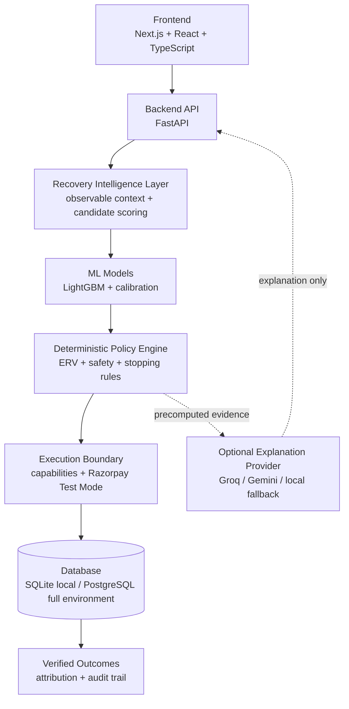

# RecoverIQ

**AI Revenue Recovery Agent for safe, adaptive recurring-payment recovery**

> "RecoverIQ is an AI-powered revenue recovery agent that detects revenue leakage, diagnoses failure causes, selects optimal recovery actions using ML and policy intelligence, executes bounded recovery workflows through payment integrations, and maintains measurable recovery attribution with explainable AI."

RecoverIQ addresses the full path from a revenue-loss signal to a verified, attributable outcome. It combines machine-learning predictions, Expected Recovery Value (ERV), deterministic policy controls, payment-provider integration, and explanation-only generative AI in one auditable recovery platform.

The agent is intentionally bounded: machine learning estimates what may work, deterministic policy decides what is allowed, Razorpay reports what actually happened, and an optional LLM explains only the resulting evidence. Models and LLMs cannot independently move money, bypass policy, or mark revenue as recovered.

For judges, recruiters, and interviews:

> "RecoverIQ combines revenue recovery automation with AI-driven decision intelligence to help businesses recover lost revenue while maintaining safety, auditability, and policy boundaries."

## What does RecoverIQ mean?

RecoverIQ combines two ideas:

### Recover

**Recover** represents the system's purpose: recovering business revenue that would otherwise be lost.

Examples include:

- failed payments;
- subscription renewal failures;
- checkout abandonment;
- overdue invoices.

The system identifies revenue at risk and determines whether a safe recovery opportunity exists.

### IQ

**IQ** represents the intelligence layer behind the recovery process:

- machine-learning-based prediction;
- intelligent recovery decisions;
- Expected Recovery Value analysis;
- policy-driven action selection;
- AI-generated explanations.

RecoverIQ does not blindly retry every payment. It analyzes observable signals, compares permitted interventions, and applies deterministic safety boundaries before any execution.

## An end-to-end revenue recovery platform

RecoverIQ is not only a payment failure prediction system. It is an end-to-end revenue recovery platform that:

- detects revenue at risk;
- identifies why revenue is being lost;
- uses machine learning to estimate recovery probability;
- uses Expected Recovery Value (ERV) policy intelligence to select the best intervention;
- executes safe and bounded recovery workflows;
- tracks recovered revenue and maintains audit trails;
- provides explainable AI summaries without allowing LLMs to override business decisions.

This separation of responsibilities is central to the design: prediction informs the decision, policy authorizes the intervention, an explicit capability boundary controls execution, provider evidence verifies the outcome, and attribution measures the recovered value exactly once.

## How RecoverIQ Works

```text
Customer payment failure
          |
          v
Revenue risk detection
          |
          v
Root-cause analysis
          |
          v
ML recovery prediction
          |
          v
ERV decision engine
          |
          v
Recovery action execution
          |
          v
Outcome tracking and attribution
          |
          v
Explainable AI summary
```

Each stage has a distinct authority boundary. Detection and ML produce evidence, the deterministic policy selects only supported and permitted actions, the execution layer exposes only explicit capabilities, signed payment events verify outcomes, and the AI explanation layer remains downstream and non-authoritative.

## Razorpay Track Alignment

RecoverIQ aligns with the Razorpay AI Revenue Recovery track by addressing the complete revenue recovery lifecycle:

1. **Detect revenue leakage** — recognize failed recurring payments and advisory payment-health degradation signals.
2. **Diagnose failure causes** — organize observable failure reason, timing, payment, and recovery-episode context without using hidden or future data.
3. **Decide the optimal intervention** — estimate action-conditioned recovery probability, calculate ERV, and apply deterministic support and safety rules.
4. **Execute bounded recovery workflows** — map an authorized decision to explicit capabilities, including Razorpay Test Mode Payment Link execution, while enforcing retry, contact, horizon, and idempotency limits.
5. **Measure recovered revenue with auditability** — verify signed provider outcomes, record attribution exactly once, preserve a redacted audit trail, and generate human-readable explanations.

> **Current scope:** RecoverIQ V1 focuses on failed recurring and subscription payments. Razorpay integration is deliberately restricted to Test Mode, and the currently implemented real provider capability is a non-partial Payment Link. Checkout abandonment and overdue invoices are related future extensions rather than implemented claims.

## 1. Project Overview

### The problem

Businesses lose revenue for many reasons besides a customer deliberately refusing to pay:

- a card expires or has insufficient funds;
- an issuer, payment network, or authentication step is temporarily unhealthy;
- a retry happens at the wrong time;
- a customer forgets to update a payment method;
- checkout or payment friction causes abandonment;
- a subscription charge fails repeatedly;
- an invoice becomes overdue without an effective follow-up path.

A fixed “retry everything tomorrow” workflow treats these situations as identical. It can waste retries, contact customers unnecessarily, increase payment friction, and still miss the best recovery opportunity.

RecoverIQ exists to make recovery **adaptive but bounded**. It uses only currently observable evidence, estimates the likely value of permitted actions, applies deterministic safety rules, and stops or asks for human review when the evidence is incomplete.

### How RecoverIQ closes the loop

```text
Detection
   ↓
Diagnosis
   ↓
Decision
   ↓
Bounded recovery action
   ↓
Verified payment outcome
   ↓
Exactly-once measurement and audit
```

- **Detection** finds a failed payment or an unusual operational pattern.
- **Diagnosis** builds a safe view of the payment, failure, and recovery episode.
- **Decision** compares action-level probabilities and expected recovery value.
- **Recovery action** runs only if the deterministic policy and execution capability allow it.
- **Payment outcome** comes from an authenticated provider event, not from a model or LLM.
- **Measurement** records an outcome and recovery attribution at most once.

### Current evidence

- Recovery Model V2 passed its one-time held-out quality gate on 62,918 decisions across 27,451 synthetic episodes.
- Sequential Policy V2 recovered 75.97% of 27,406 sealed synthetic validation episodes versus 53.09% for Reminder + Retry, with zero policy violations.
- Detector V2 failed its registered hard-policy safety gate and therefore remains advisory-only.
- One real Razorpay Test Mode INR 1.00 Payment Link completed create/fetch, signed `payment_link.paid`, exact matching, exactly-once attribution, recovery transition, and duplicate replay verification.
- All overall-final seeds remain untouched.

These results are **simulation and Test Mode evidence**, not production revenue claims.

## 2. Architecture Overview



### Layer responsibilities

| Layer | Responsibility |
|---|---|
| Frontend | Provides responsive recovery operations, audit, provider status, evaluation, and explanation views |
| Backend API | Serves health and recovery endpoints, receives webhooks, and coordinates services |
| Recovery intelligence | Builds observable episode context and enumerates feasible recovery candidates |
| ML models | Estimate action-conditioned probability of recovery; they do not authorize actions |
| Policy engine | Calculates ERV, applies rules and support checks, selects an action, stops, or requests review |
| Execution boundary | Maps a decision to an explicit capability and prevents unsupported provider side effects |
| Payment integration | Creates/fetches Razorpay Test Mode Payment Links and validates provider webhooks |
| Database and audit | Persists cases, decisions, plans, executions, verified outcomes, attribution, and audit events |
| Explanation layer | Converts already-computed evidence into validated human-readable explanations |

### Two intentionally separate paths

RecoverIQ has a reproducible **offline intelligence path** and a safe **runtime integration path**:

1. The simulator produces leakage-safe training/evaluation evidence for Detector V2, Recovery Model V2, and Sequential Policy V2.
2. The API receives real Razorpay Test Mode events and preserves the provider execution/outcome boundary.

The real-provider adapter does not yet have every historical field and category mapping required by frozen Model V2. It therefore routes incomplete first-event context to `HUMAN_REVIEW` instead of inventing model inputs. This is a deliberate safety behavior.

## 3. Complete Technology Stack

### Backend

- **Python 3.12** — primary backend, simulator, detector, ML, and policy language.
- **FastAPI** — typed REST APIs and asynchronous webhook request handling.
- **Pydantic / pydantic-settings** — request/response validation and secret-safe typed configuration.
- **Uvicorn** — ASGI development/application server.
- **HTTPX** — explicit Razorpay HTTP integration and test transports.
- **Celery** — background-job boundary; eager locally, Redis-backed in a full environment.
- **Redis** — Celery broker/result backend outside eager local mode.
- **Structlog** — structured JSON-compatible application logging.

FastAPI is used because it provides strong type-driven validation, automatic OpenAPI documentation, dependency injection, and efficient request handling without hiding the domain-service boundaries.

Implemented API responsibilities include:

- `GET /health` for safe service health;
- Razorpay integration status;
- RecoveryCase summary, detail, and audit endpoints;
- an explicit operator Test Mode Payment Link endpoint;
- `POST /webhooks/razorpay` for authenticated provider events.

### Database

- **PostgreSQL 17** is the full-environment target.
- **SQLite** is the zero-container local development and test default.

The domain stores:

- merchants, customers, subscriptions, payments, and payment attempts;
- recovery cases and correlation identifiers;
- failure evidence and frozen decision records;
- execution plans and external provider executions;
- webhook receipts and normalized provider mappings;
- verified external outcomes;
- exactly-once recovery attribution;
- redacted audit events.

Amounts are stored as integer minor units, and timestamps are generated in UTC.

### ORM and migrations

- **SQLAlchemy 2** maps typed Python domain models to portable relational tables.
- **Alembic** provides explicit, reviewable database migrations.
- **Psycopg 3** connects SQLAlchemy to PostgreSQL in full environments.

The API, migrations, and Celery tasks consistently use synchronous SQLAlchemy sessions. Application startup checks connectivity but does not silently change the schema.

### Frontend and developer tooling

- **Next.js 16 App Router**
- **React 19**
- **TypeScript 5**
- **Tailwind CSS 4**
- **shadcn/ui**, Base UI, and Lucide icons
- **uv** for locked Python environments
- **npm** for locked frontend dependencies
- **GitHub Actions** for backend, simulator, and frontend CI

## Technology Requirements

A new developer can clone RecoverIQ and reproduce every environment from the checked-in lockfiles. Python dependencies are canonically locked by `apps/api/uv.lock` and `simulator/uv.lock`; frontend dependencies are locked by `apps/web/package-lock.json`.

### Required developer tools

| Technology | Supported/tested version | Purpose |
|---|---:|---|
| Python | `>=3.12,<3.13` (tested `3.12.10`) | API, simulator, detector, ML, and policy |
| uv | tested `0.12.5` | Locked Python installation and commands |
| Node.js | `24` LTS (tested `24.19.0`) | Next.js runtime and build |
| npm | tested `11.17.0` | Locked frontend installation |
| Git | current supported release | Source control |
| Docker Engine | optional; tested `29.7.2` | PostgreSQL/Redis service containers |
| Docker Compose | optional; tested `5.5.0` | Local multi-service orchestration |

### Locked backend and AI packages

| Technology | Locked version |
|---|---:|
| FastAPI | `0.141.1` |
| Uvicorn | `0.52.4` |
| SQLAlchemy | `2.0.52` |
| Alembic | `1.19.1` |
| Pydantic | `2.13.4` |
| Psycopg (PostgreSQL driver) | `3.3.4` |
| Celery | `5.6.3` |
| Redis client | `7.4.1` |
| pytest | `9.1.1` |
| Ruff | `0.16.4` |
| mypy | `2.3.1` |
| google-genai (optional Gemini provider) | `1.75.0` |
| OpenAI-compatible client (Groq provider) | `2.54.0` |

SQLite support comes from Python's standard library; no separate SQLite package is required.

### Locked machine-learning packages

| Technology | Locked version |
|---|---:|
| LightGBM | `4.7.0` |
| scikit-learn | `1.9.0` |
| NumPy | `2.5.2` |
| pandas | `3.0.5` |
| SHAP | `0.52.0` |

### Locked frontend and infrastructure

The frontend uses Next.js `16.3.2`, React `19.2.8`, TypeScript `5.9.3`, ESLint `9.39.5`, Tailwind CSS `4.3.3`, Base UI `1.7.0`, shadcn `4.19.0`, Lucide React `1.33.0`, and `tw-animate-css` `1.4.0`. Charts are first-party responsive SVG/CSS components, and motion uses CSS transitions/keyframes rather than an additional runtime animation framework.

Docker Compose pins the service tags `postgres:17-alpine` and `redis:7.4-alpine`.

Compatibility files are provided for standard tooling:

- `requirements.txt` composes the backend and simulator Python environments;
- `requirements/backend.txt` is an exact export of `apps/api/uv.lock` including development tools;
- `requirements/simulator.txt` is an exact export of `simulator/uv.lock` including development tools;
- `requirements/frontend.md` records the frontend runtime and direct package versions.

For the strongest reproducibility, prefer `uv sync --locked` and `npm ci`; the compatibility files are generated views of those canonical locks.

## 4. Machine Learning Stack

### LightGBM

LightGBM is the primary tabular Recovery Model V2. It estimates:

> “Given the observable payment and recovery-episode state, what is the probability that this specific candidate action recovers the payment before the next decision?”

Those probabilities support action comparison and ranking. LightGBM does not decide whether an action is safe, feasible, supported, or executable.

### Scikit-learn

Scikit-learn supports:

- logistic-regression baselines;
- Brier score, log loss, ROC-AUC, and PR-AUC evaluation;
- calibration methods;
- deterministic preprocessing/model pipelines;
- model-selection comparisons against the LightGBM primary.

### Isotonic regression

A ranking model can correctly order actions while still producing probabilities that are too high or too low. ERV depends directly on probability, so poor calibration can turn into poor financial comparisons.

Isotonic regression learns a monotonic mapping from raw model scores to observed recovery frequency on a separate calibration seed group. The calibrator is frozen before held-out policy evaluation.

### SHAP

SHAP produces structured evidence describing which approved model features influenced predictions globally and for selected local examples. It helps engineers inspect model behavior; it cannot authorize actions or override policy.

### Reproducibility and leakage controls

- training, development, calibration, held-out, policy-validation, and final seed groups are disjoint;
- hidden customer traits, true cause, incident truth, future events, oracle actions, and counterfactual outcomes are forbidden model inputs;
- Model V2 deliberately excludes Detector V2/payment-health features because earlier held-out evidence did not show primary recovery benefit;
- model, feature-schema, calibration, and policy files have recorded hashes;
- one-time evaluation commands refuse silent overwrite or rerun.

## 5. Recovery Intelligence Engine

### Expected Recovery Value (ERV)

RecoverIQ does not simply choose the cheapest action or the action with the highest raw probability. It compares incremental expected value:

```text
ERV = round(P(recovery) × recoverable amount)
      − intervention cost
      − customer-friction cost
```

#### Beginner example

Suppose ₹1,000 is recoverable:

| Candidate | Recovery probability | Expected recovered value | Estimated cost/friction | ERV |
|---|---:|---:|---:|---:|
| Retry later | 40% | ₹400 | ₹5 | ₹395 |
| Payment Link | 60% | ₹600 | ₹15 | ₹585 |

The Payment Link costs more, but it has the greater expected recovered value. The policy may prefer it **only if** it also passes support, feasibility, contact, horizon, duplicate-link, and other safety rules.

All real calculations use integer minor units and deterministic round-half-up arithmetic.

### Candidate actions

The simulator/policy can reason about:

- retry now;
- retry after 2, 6, 12, or 24 hours;
- send a nudge or reminder;
- create a Payment Link;
- request a payment-method update;
- offer an alternate payment route;
- stop or escalate to human review.

An action label is not automatically a provider call. In the current runtime, only `CREATE_PAYMENT_LINK` has a real Razorpay Test Mode execution capability. Retry actions are internal scheduling concepts, and messaging/method-change actions remain recommendations.

## 6. Sequential Policy Engine

RecoverIQ can adapt after observing that an intervention failed. Sequential Policy V2 replans for at most three autonomous interventions inside a 48-hour recovery horizon.

Conceptual example:

```text
Attempt 1: Retry payment after an appropriate delay
    ↓ failed
Attempt 2: Create or recommend a Payment Link
    ↓ unresolved
Attempt 3: Use another feasible bounded action or escalate
    ↓
STOP / HUMAN_REVIEW — never an unbounded fourth attempt
```

At every decision point, the policy:

1. rebuilds observable trajectory state;
2. enumerates feasible actions;
3. obtains calibrated action probabilities;
4. computes incremental ERV;
5. applies deterministic rules and model-support checks;
6. selects one positive supported action, stops, or requests human review.

### Safety and stopping rules

- maximum three interventions;
- maximum retry and customer-contact budgets;
- minimum retry intervals;
- quiet-hours scheduling;
- customer opt-out enforcement;
- duplicate Payment Link prevention;
- 48-hour recovery horizon;
- action feasibility and schema validation;
- minimum model support by action/stage/calibration region;
- no action with non-positive incremental ERV;
- attribution at most once.

Unsupported or contradictory evidence leads to `HUMAN_REVIEW`; exhausted budgets, horizon, infeasibility, or non-positive value lead to `STOP`.

## 7. Detection System

### Detector V1

Detector V1 is the historical statistical benchmark. It compares rolling issuer/payment-method behavior with historical baselines and produces incident candidates, lifecycle state, severity, timing, and diagnostic evidence.

It demonstrated the value—and difficulty—of detecting payment degradation from sparse event streams. It was never accepted as autonomous payment-action authority.

### Detector V2

Detector V2 adds a more operational sequential method:

- empirical-Bayes baselines using only prior observations;
- one-sided likelihood/CUSUM evidence for several possible success-rate drops;
- separate issuer, payment-method, and global scopes;
- `HEALTHY → WATCH → CONFIRMED → RECOVERING → RESOLVED` lifecycle;
- frozen baselines while an incident is active;
- failure-reason distribution shift evidence;
- minimum local support, hysteresis, cooldown, and recovery rules.

`WATCH` is an early advisory signal. `CONFIRMED` requires stronger evidence, but its registered held-out hard-policy gate failed because precision was too low and false confirmations were slightly above the allowed threshold.

**Detection outputs are signals, not authority.** Detector V2 cannot override Sequential Policy V2, directly trigger payment execution, or mark a recovery outcome. Primary Recovery Model V2 also excludes detector/payment-health features.

## 8. Razorpay Integration

RecoverIQ integrates with the Razorpay REST API and webhooks in **Test Mode only**.

### Implemented capabilities

- Test Mode Basic authentication held only on the backend;
- Standard Payment Link creation and fetch/reconciliation;
- non-partial INR Payment Links with notifications/reminders disabled;
- signed webhook ingestion;
- subscription, payment-failure, and Payment Link event normalization;
- out-of-order tolerance and durable event deduplication;
- separate execution, outcome, attribution, and audit persistence.

### Payment Link flow

```text
Failed recurring payment / approved recovery case
    ↓
RecoverIQ persists an execution plan and unique reference
    ↓
Razorpay Test Mode Payment Link is created
    ↓
Customer completes the Test Mode payment
    ↓
Razorpay sends payment_link.paid
    ↓
RecoverIQ validates signature, event ID, link, reference, amount, currency, and status
    ↓
ExternalOutcome + exactly-one RecoveryAttribution
    ↓
RecoveryCase transitions to RECOVERED exactly once
```

### Security controls

- HMAC-SHA256 validation over the exact raw request body;
- constant-time signature comparison;
- required unique `x-razorpay-event-id`;
- 1 MiB webhook body limit and JSON-object validation;
- allowlisted redacted persistence instead of raw payload retention;
- database uniqueness for event, execution, provider reference, outcome, and attribution;
- idempotent replay handling;
- ambiguous create outcomes remain `UNKNOWN` and reconcile before replacement;
- non-test Razorpay modes and non-`rzp_test_` Key IDs are rejected.

The real Phase 7.5 proof used one synthetic INR 1.00 Payment Link. A Payment Link proves alternate Test Mode revenue recovery; it does not repair the original subscription mandate and is not a Live Mode claim.

## 9. AI Explanation Layer

The LLM layer is deliberately outside the decision and payment authority path.

### What an LLM may do

- explain an already-computed decision trace;
- summarize supplied recovery-case evidence;
- list key factors and limitations;
- provide human-readable reasoning in a strict schema.

### What an LLM may not do

- choose or change a recovery action;
- modify ERV, probabilities, or policy results;
- bypass stopping, support, or safety rules;
- call Razorpay or create a Payment Link;
- decide that money moved;
- create an outcome, attribution, or recovered transition.

### Providers

- **Groq** is the optional primary remote provider.
- The configured model is **`openai/gpt-oss-120b`**.
- Groq is accessed through its OpenAI-compatible API using the OpenAI client.
- **Gemini** remains an optional disabled-by-default provider retained from earlier integration work.
- **Deterministic fallback** is the credential-free default and keeps the system usable when remote AI is unavailable.

All provider implementations conform to `ExplanationProvider`, initialize lazily, use bounded timeouts/retries, and return a locally validated `DecisionExplanation` with only:

- `summary`;
- `factors`;
- `confidence` in explanation fidelity;
- `limitations`.

Extra/authoritative fields are rejected. Provider failure cannot break recovery processing. The provider abstraction also allows future models without coupling business code to one SDK.

## 10. Frontend

The frontend uses:

- Next.js App Router;
- React;
- TypeScript;
- Tailwind CSS;
- shadcn/ui, Base UI, and Lucide icons.

Its intended operational purpose is to help revenue and payment-operations teams monitor:

- API and environment health;
- recovery cases and status;
- payment-health signals;
- policy decision traces;
- external execution and exactly-once attribution;
- audit history and evaluation evidence.

The current implementation is a responsive operations product. It provides a live Command Center, Payment Health, searchable Recovery Queue, case detail, redacted audit timeline, Decision Trace, Razorpay Test Mode status and guarded Payment Link workflow, user-triggered AI explanations, and a read-only Evaluation Lab. Loading, empty, invalid-route, backend-offline, retry, confirmation, and duplicate-submission states are explicit. Operational metrics are derived from persisted API data; missing evidence is shown honestly instead of being fabricated.

Frontend quality is enforced with strict TypeScript, ESLint, and a production Next.js build.

## 11. Infrastructure

### Docker and Docker Compose

Docker provides isolated, reproducible service environments. Docker Compose describes how multiple dependent services start together with consistent ports, health checks, volumes, and environment values.

The current `docker-compose.yml` runs:

- PostgreSQL 17;
- Redis 7.4.

The backend and frontend run directly on the development host today. A future deployment can containerize and compose the API, Celery worker, frontend, database, and Redis together.

### Local and full-environment modes

| Concern | Local default | Full environment |
|---|---|---|
| Database | SQLite | PostgreSQL |
| Celery | Eager, memory transport | Worker + Redis |
| Explanation | Deterministic fallback | Optional Groq/Gemini |
| Payments | Simulation | Explicit Razorpay Test Mode |

This workspace’s Windows Server VM has no usable Linux container daemon, so local validation uses SQLite and eager Celery while preserving the same architectural boundaries.

## 12. Testing

### Backend tests

Pytest covers:

- settings and secret masking;
- health, database, migrations, and Celery boundaries;
- domain models;
- LLM schemas, authority rejection, timeouts, invalid output, and fallback;
- Razorpay gateway contracts;
- raw-body webhook signatures;
- event deduplication and out-of-order handling;
- Payment Link idempotency/reconciliation;
- exact amount/reference validation;
- outcomes and exactly-once attribution.

### Simulator, detector, ML, and policy tests

The simulator suite covers:

- deterministic event generation and semantic random draws;
- hidden-truth and leakage boundaries;
- counterfactual fairness;
- detector lifecycle and methodology;
- seed-group separation and final-seed guards;
- model features, logging, calibration, frozen hashes, and held-out rerun refusal;
- exact ERV arithmetic and policy rules;
- bounded sequential behavior, attribution, and sealed validation artifacts.

### Code quality and security checks

- **Ruff** for Python linting/import/style checks;
- **strict mypy** for typed backend and simulator code;
- **ESLint** for frontend quality;
- **TypeScript `--noEmit`** for static frontend validation;
- **Next.js production build** for compilation and static generation;
- exact-value and provider-pattern secret scans;
- Git status/diff checks for frozen artifacts and seed files.

### Latest final validation

| Gate | Result |
|---|---|
| API Pytest | 58 passed |
| Simulator/detector/model/policy Pytest | 128 passed |
| **Total** | **186 passed, 0 failed** |
| Ruff | Passed |
| Strict mypy | Passed |
| ESLint | Passed |
| TypeScript | Passed |
| Next.js build | Passed |
| Locked dependency dry runs | Passed |
| Docker Compose configuration | Passed |
| Secret scan | Passed |

CI runs normal tests without Docker, PostgreSQL, Redis, Razorpay, Groq, or Gemini credentials.

## 13. Error Handling

RecoverIQ treats expected failures as explicit states rather than silent fall-throughs:

- FastAPI and Pydantic reject missing or malformed request fields with typed `4xx` responses;
- unknown recovery identifiers return `404`, unavailable integrations return `503`, state conflicts return `409`, and signature failures return `400` before processing;
- Razorpay create timeouts reconcile by the idempotent receipt when possible and block unsafe replacement when provider state is unknown;
- duplicate and out-of-order webhooks are durably acknowledged without duplicate execution, outcome, attribution, or state regression;
- provider failures, timeouts, empty responses, and invalid LLM output activate the deterministic explanation fallback;
- the ML/policy path abstains or routes to review for missing schemas, low support, unsafe candidates, small margins, or unsupported actions;
- the frontend validates API response shapes and renders loading, empty, friendly error, and retry states without exposing raw stack details.

No error path grants an LLM, payment provider, or detector authority to bypass deterministic policy and execution controls.

## 14. Security Design

- Secrets are loaded from environment variables or an ignored local `.env`.
- `.env.example` contains names and empty placeholders only.
- Pydantic `SecretStr` prevents normal secret representation/serialization.
- No provider key is stored in source, tests, documentation, Git history, API responses, or audit evidence.
- Razorpay Live Mode is absent; configuration accepts only provider mode `test`.
- Webhooks are authenticated before JSON parsing or persistence.
- Raw payment payloads, signatures, PAN, CVV, OTP, and unnecessary PII are forbidden from logs, prompts, and audit metadata.
- Unique database constraints and idempotency keys protect event receipt, execution, outcome, and attribution.
- Models predict; deterministic policy authorizes; capability checks permit execution; provider events prove payment outcomes; LLMs only explain.
- Incomplete or contradictory evidence leads to ignore, `UNKNOWN`, `STOP`, or `HUMAN_REVIEW`—never optimistic success.

For more detail, see [Safety and Trust Boundaries](docs/SAFETY.md).

## 15. Project Directory Structure

```text
RecoveryIQ/
├── apps/
│   ├── api/                 FastAPI, domain models, services, AI, Razorpay, tests
│   └── web/                 Next.js operational shell
├── simulator/
│   ├── recoveriq_simulator/ Deterministic payment environment and baselines
│   ├── recoveriq_detector*/ Detector V1/V2
│   ├── recoveriq_ml*/       Recovery Model V1/V2 pipelines
│   ├── recoveriq_policy*/   ERV Policy V1 and evaluation tools
│   └── recoveriq_sequential*/ Sequential environment and Policy V2
├── artifacts/
│   ├── detector*/           Frozen detector configuration and validation
│   ├── ml/                  Frozen models, calibrators, and reports
│   └── policy/              Frozen policies, traces, and validation evidence
├── docs/                    Architecture, safety, methodology, runbooks, evidence
├── infra/                   Reserved deployment-specific configuration
├── scripts/                 Reserved reproducible workflow entry points
├── .github/workflows/       Continuous integration
├── docker-compose.yml       PostgreSQL and Redis services
├── .env.example             Safe local configuration template
└── README.md                Project entry point
```

Important evidence documents:

- [Architecture](docs/ARCHITECTURE.md)
- [Recovery Model V2](docs/RECOVERY_MODEL_V2.md)
- [Sequential Recovery](docs/SEQUENTIAL_RECOVERY.md)
- [Detector V2](docs/DEGRADATION_DETECTION_V2.md)
- [Razorpay Integration](docs/RAZORPAY_INTEGRATION.md)
- [Phase 7.5 Test Mode Evidence](docs/RAZORPAY_PHASE_7_5_TEST_MODE_EVIDENCE.md)
- [Explanation Provider Design](docs/GEMINI_DESIGN.md)
- [Final Cleanup Report](FINAL_CLEANUP_REPORT.md)

## 16. Installation and Running Locally

The commands below use PowerShell from the repository root.

### Prerequisites

- Git;
- Python 3.12;
- [uv](https://docs.astral.sh/uv/);
- Node.js 24 LTS and npm;
- Docker Engine with Compose, optional for PostgreSQL/Redis mode.

No external credential is required for normal startup or tests.

`requirements.txt` exists for conventional Python tooling and dependency scanners. The canonical installation path remains `uv sync --locked`, because the two Python applications have separate lockfiles and project metadata.

### 1. Clone and enter the repository

```powershell
git clone <repository-url> RecoveryIQ
Set-Location RecoveryIQ
```

### 2. Create local configuration

```powershell
Copy-Item .env.example .env
```

Keep `.env` local. The defaults select SQLite, eager Celery, simulation, and deterministic explanations.

### 3. Install and run the backend

```powershell
Set-Location apps/api
uv sync --dev --locked
uv run alembic upgrade head
uv run uvicorn app.main:app --reload
```

Open:

- API health: `http://127.0.0.1:8000/health`
- OpenAPI UI: `http://127.0.0.1:8000/docs`

### 4. Install and run the frontend

Open a second PowerShell terminal:

```powershell
Set-Location apps/web
npm ci
npm run dev
```

Open `http://localhost:3000`. It uses `http://localhost:8000` by default.

### 5. Optional PostgreSQL and Redis

From the repository root on a supported Docker host:

```powershell
docker compose up -d postgres redis
```

Then set the PostgreSQL `DATABASE_URL`, set `CELERY_TASK_ALWAYS_EAGER=false`, apply migrations, and run a Celery worker. See `.env.example` and [Architecture](docs/ARCHITECTURE.md).

### 6. Run backend checks

```powershell
Set-Location apps/api
uv run ruff check .
uv run mypy app tests
uv run pytest
```

### 7. Run simulator, detector, model, and policy checks

From the repository root, sync the locked environment and then run quality gates from the simulator project directory so mypy resolves the configured package names correctly:

```powershell
uv sync --project simulator --dev --locked
Set-Location simulator
uv run ruff check .
uv run mypy `
  recoveriq_simulator `
  recoveriq_detector `
  recoveriq_detector_v2 `
  recoveriq_ml `
  recoveriq_ml_v2 `
  recoveriq_policy `
  recoveriq_policy_evaluation `
  recoveriq_sequential `
  recoveriq_sequential_policy `
  tests
uv run pytest
```

### 8. Run frontend checks

```powershell
Set-Location apps/web
npm run lint
npm run typecheck
npm run build
```

### 9. Run a deterministic simulator benchmark

From the repository root:

```powershell
uv run --project simulator python -m recoveriq_simulator.cli benchmark --seed 20260821
```

Generated simulation runs are ignored under `artifacts/simulations/`. Do not run reserved overall-final seeds during ordinary development.

### Optional external providers

Groq and Razorpay Test Mode are explicit opt-ins. Put secrets only in ignored `.env`; never put them in source, documentation, screenshots, or shell history shared with others.

For Razorpay Test Mode, use the [beginner runbook](docs/RAZORPAY_TEST_DEMO.md). Do not use Live Mode credentials and do not create unnecessary Test Mode resources.

## 17. Demo Flow

### Target adaptive recovery lifecycle

```text
1. A recurring customer payment fails.
2. RecoverIQ records normalized observable failure evidence.
3. Advisory detection reports any unusual payment-health pattern.
4. Recovery Model V2 estimates recovery probability for feasible actions.
5. The ERV engine compares probability, amount, cost, and friction.
6. Sequential Policy V2 applies support, budget, horizon, and safety rules.
7. An execution capability permits the selected action—or the system stops/reviews.
8. A Razorpay Test Mode Payment Link may be created for an approved link action.
9. The customer completes the Test Mode payment.
10. Razorpay sends a signed payment_link.paid webhook.
11. RecoverIQ verifies signature, event ID, reference, amount, currency, and status.
12. The outcome, attribution, recovered transition, and audit trail are recorded once.
13. An optional LLM can explain the completed decision evidence; it changes nothing.
```

### Current runtime boundary

The intelligence components are fully evaluated offline, but complete real-provider history mapping is not yet available. For the first external event, the API safely chooses `HUMAN_REVIEW / INSUFFICIENT_CONTEXT`. The verified Phase 7.5 Payment Link used an explicitly labelled operator Test Mode fallback through the normal persisted execution, outcome, attribution, and audit path.

This distinction prevents a demo integration from pretending that missing provider data is valid model input.

## 18. Limitations and Future Improvements

### Current limitations

- Evaluation data is hand-designed synthetic evidence, not real-customer training data.
- Detector V2 failed its hard-policy gate and remains advisory-only.
- Complete provider-history/category mapping for online Model V2 scoring is not implemented.
- The real provider proof covers one Razorpay Test Mode Payment Link, not Subscription E2E or Live Mode.
- API authentication, merchant tenancy, and operator roles are not implemented.
- SQLite/eager Celery do not prove PostgreSQL/Redis multi-worker concurrency.
- The local demonstration dataset is sparse, so its charts intentionally show limited trend history.
- The existing operator-created fallback case has no persisted model decision; the UI exposes that missing evidence instead of inventing it.
- LLM enrichment is connected through a code-enforced evidence allowlist, but external provider availability remains non-deterministic; the local fallback is therefore mandatory.
- No line/branch coverage report or frontend browser E2E suite is published.

### Future production improvements

- authenticated merchant/operator accounts and role-based authorization;
- a validated provider-history adapter for real-time Model V2/Policy V2 use;
- production PostgreSQL, Redis, Celery workers, row locking, and concurrency tests;
- broader payment-provider adapters behind the same capability interface;
- more representative, consented, privacy-safe training data and monitored recalibration;
- model drift, calibration, detector, execution, and provider-SLA monitoring;
- code-enforced LLM evidence allowlists, circuit breaking, caching, and safe metrics;
- full Recovery Queue, Decision Trace, Payment Health, and Evaluation Lab views;
- browser E2E, accessibility, load, chaos, and deployment tests;
- production-grade secret management, rate limiting, alerting, retention, and incident response.

Any future detector/model/policy generation should use new preregistered seeds and preserve the existing frozen evidence rather than rewriting it.

## 19. For Judges / Interview Explanation

**RecoverIQ is an AI-assisted revenue recovery platform that combines leakage-safe machine learning, calibrated action scoring, deterministic expected-value policy, bounded sequential recovery, secure Razorpay Test Mode automation, exactly-once revenue attribution, and explanation-only generative AI. Its main innovation is not simply predicting whether a payment may recover; it closes the loop from observable failure evidence to a safe action, verified provider outcome, and auditable measurement while preventing the model, detector, or LLM from becoming unchecked financial authority.**

For a concise final audit and submission state, read [FINAL_CLEANUP_REPORT.md](FINAL_CLEANUP_REPORT.md).
