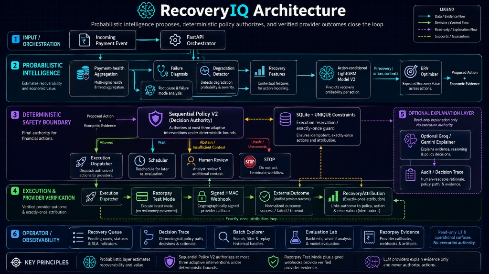
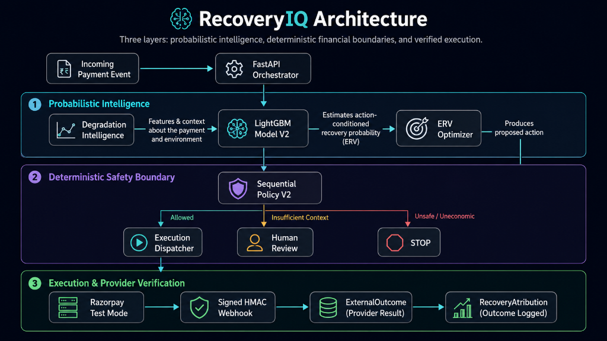

# RecoveryIQ

### Autonomous Revenue Recovery Control Plane for Razorpay-style payment workflows

RecoveryIQ detects revenue at risk, estimates **action-conditioned recovery probability**, optimizes interventions using **Expected Recovery Value (ERV)**, and executes supported recovery workflows under strict deterministic safety boundaries.

> **Evidence note:** All portfolio evaluation results are **simulated** and do not represent Razorpay production revenue. Razorpay integration evidence uses **Test Mode only**. **No real money is moved.**

---

## 💸 The Business Problem

A failed payment does not automatically mean **"retry it now."**

Failures can come from customer liquidity, expired instruments, mandate issues, transient network errors, or broader issuer/payment-method degradation. Blind retries can waste attempts, increase customer friction, and optimize for recovery probability instead of economic value.

RecoveryIQ separates intelligence from financial authority:

**Detect → Predict → Optimize → Guard → Execute → Verify → Attribute**

The model predicts what may work. **ERV** evaluates what is economically worthwhile. The **deterministic policy** decides what is allowed. **Razorpay provider evidence** verifies what actually happened. The **LLM only explains**.

---

## ⚡ RecoveryIQ in 60 Seconds

RecoveryIQ is an autonomous revenue recovery control plane built to avoid naive payment retries and unsafe AI execution.

It uses event-driven payment-failure correlation and **action-conditioned LightGBM V2** models to estimate recovery probability under candidate actions. **Expected Recovery Value (ERV)** balances probability, recoverable revenue, intervention cost, and customer friction.

Every recommendation passes through **Sequential Policy V2**, which enforces deterministic limits on retries, contacts, interventions, and recovery horizon. Supported actions can execute through **Razorpay Test Mode**, while signed HMAC webhooks establish provider truth and database uniqueness constraints protect local outcomes and recovery attribution from duplication.

The LLM remains strictly **explanation-only** and has no financial execution authority.

---

## 🧭 Explore RecoveryIQ

| Document | Why It Matters |
| --- | --- |
| [Architecture](docs/ARCHITECTURE.md) | ML → ERV → deterministic policy → execution → provider verification → attribution |
| [Evaluation Results](docs/EVALUATION_RESULTS.md) | Sealed benchmark, methodology, baselines, and economic evidence |
| [Safety & Reliability](docs/SAFETY_AND_RELIABILITY.md) | Idempotency, concurrency verification, and reliability boundaries |
| [Razorpay Evidence](docs/RAZORPAY_EVIDENCE.md) | Test Mode Payment Link → signed webhook → outcome → attribution lifecycle |
| [Degradation Detection V2](docs/DEGRADATION_DETECTION_V2.md) | Advisory degradation intelligence across supported scopes |

---

## 🎯 Track 03 Control Loop

| Track Stage | RecoveryIQ |
| --- | --- |
| **DETECT** | Event-driven revenue-at-risk correlation + advisory degradation context |
| **DECIDE** | Action-conditioned Recovery Model V2 + Expected Recovery Value optimization |
| **GUARD** | Deterministic Sequential Policy V2 bounds retries, contacts, interventions, and horizon |
| **EXECUTE** | Executes supported actions or safely defers to `HUMAN_REVIEW` / `STOP` |
| **VERIFY** | Authenticates Razorpay Test Mode evidence through signed webhooks |
| **ATTRIBUTE** | Maps verified `ExternalOutcome` → `RecoveryAttribution` with exactly-once local semantics |
| **MEASURE** | Evaluates performance across 27,406 sealed simulated episodes |

---

## 📊 Headline Evidence

The sealed evaluation of RecoveryIQ Sequential Policy V2 produced the following results.

> **All SEALED · SIMULATED values are simulation outputs and are NOT provider revenue.**

| Metric | Value | Evidence Lane |
| --- | ---: | --- |
| **Sealed Episodes** | 27,406 | SEALED · SIMULATED |
| **Recovered Episodes** | 20,821 | SEALED · SIMULATED |
| **Recovery Rate** | 75.97% | SEALED · SIMULATED |
| **Simulated Net Recovery Value** | ₹4,71,96,320.70 | SEALED · SIMULATED |
| **Incremental Simulated Value vs Reminder + Retry** | +₹1,44,07,440.70 | SEALED · SIMULATED |
| **Policy Violations** | 0 | SEALED · SIMULATED |
| **Razorpay Test Mode Verified Recovery** | ₹2.00 | RAZORPAY · TEST MODE |
| **10-way Webhook Race** | 10 → 1 logical event | ISOLATED LOCAL |
| **10-way Execution Race** | 10 → 1 fake-provider call | ISOLATED LOCAL |

---

## 📈 Full Recovery Strategy Benchmark

RecoveryIQ was evaluated against version-controlled strategies on the same sealed simulated evaluation set.

| Strategy | Recovered | Rate | Simulated Net Value | Retries | Contacts | Violations |
| --- | ---: | ---: | ---: | ---: | ---: | ---: |
| Greedy Hidden Oracle | 21,405 | 78.10% | ₹4,85,54,112.50 | 25,543 | 20,588 | 0 |
| Probability Policy | 20,878 | 76.18% | ₹4,72,69,616.40 | 28,610 | 20,010 | 0 |
| **RecoveryIQ Sequential ERV V2** | **20,821** | **75.97%** | **₹4,71,96,320.70** | **28,829** | **19,519** | **0** |
| Best Global Sequential | 18,774 | 68.50% | ₹4,23,99,715.00 | 37,154 | 18,851 | 0 |
| Simple Observable Rule | 17,704 | 64.60% | ₹4,01,06,631.10 | 30,819 | 24,493 | 0 |
| Reminder + Retry | 14,549 | 53.09% | ₹3,27,88,880.00 | 38,896 | 26,037 | 0 |
| Fixed Retry | 11,440 | 41.74% | ₹2,55,31,989.50 | 48,103 | 0 | 0 |

> **Trade-off:** Probability Policy achieves a slightly higher raw recovery rate (**76.18% vs 75.97%**), while RecoveryIQ Sequential ERV V2 uses fewer customer contacts and optimizes a bounded economic objective rather than raw recovery probability alone.

---

## 🏗️ Architecture

RecoveryIQ relies on three layers: **probabilistic intelligence**, **deterministic financial boundaries**, and **verified execution**.



*The detailed architecture diagram above outlines all internal components and data flows. For a quicker high-level overview, the abstract version below illustrates the core system shape and boundaries.*



[Read the full Architecture Deep Dive →](docs/ARCHITECTURE.md)

### The Execution Flow

1. **ML:** Predicts recovery probability for feasible candidate actions.
2. **ERV:** Evaluates economic value using probability, revenue, cost, and friction.
3. **Policy:** Deterministic boundaries authorize, block, escalate, or stop.
4. **Execution:** Supported actions run through the appropriate execution path.
5. **Provider:** Razorpay Test Mode verifies external payment outcomes through authenticated events.
6. **Attribution:** Verified outcomes are mapped once locally to recovery attribution.

### LLM Authority Boundary

> **MODEL PREDICTS → ERV OPTIMIZES → POLICY AUTHORIZES → PROVIDER VERIFIES → AI EXPLAINS**

The LLM is **explanation-only**. It cannot authorize payment execution, change frozen deterministic policy limits, mark a payment recovered, or modify recovery attribution.

---

## 🚀 What Makes RecoveryIQ Different

| Differentiator | Why It Matters |
| --- | --- |
| **Action-conditioned ML** | Evaluates recovery probability under each candidate action |
| **ERV optimization** | Optimizes economic value instead of maximizing raw probability alone |
| **Degradation awareness** | Adds issuer, payment-method, and global context before blindly retrying |
| **Deterministic policy** | Keeps financial authorization outside generative AI |
| **Bounded sequential recovery** | Controls retries, contacts, interventions, and recovery horizon |
| **Safe abstention** | Insufficient context can become `HUMAN_REVIEW` rather than forced automation |
| **Provider verification** | Uses authenticated Razorpay Test Mode evidence as external truth |
| **Exactly-once local attribution** | Prevents duplicate local recovery accounting |
| **Adversarial verification** | Demonstrates concurrency and idempotency defenses |

---

## 🔬 The Four Evidence Lanes

RecoveryIQ separates evidence categories so simulated performance is never confused with provider execution evidence.

| Evidence Lane | Purpose | Current Proof |
| --- | --- | --- |
| **DEMO · SYNTHETIC** | Judge-facing operational opportunities | 5 cases / ₹2,75,999 at risk |
| **SEALED · SIMULATED** | Recovery-performance evaluation | 27,406 episodes / 75.97% recovery / ₹4.71 Cr+ simulated net value |
| **RAZORPAY · TEST MODE** | Provider lifecycle verification | ₹2.00 Test recovery / **No real money moved** |
| **ISOLATED LOCAL VERIFICATION** | Reliability evidence | 10-way concurrency and idempotency verification |

> These evidence lanes are intentionally isolated and must not be financially combined.

---

## 🛡️ Safety & Reliability Highlights

RecoveryIQ verifies critical financial-state invariants under concurrent and duplicate requests.

- **10-way Webhook Race:** 10 concurrent identical webhook requests reduce to **1 logical provider event** and 9 duplicates.
- **10-way Executor Race:** 10 concurrent execution attempts result in **1 logical execution** and **1 fake-provider call**.
- **Exactly-Once Local Attribution:** Duplicate success processing creates only **1 `ExternalOutcome`** and **1 `RecoveryAttribution`** locally.
- **Bounded Policy:** Sequential Policy V2 enforces a **48-hour horizon**, maximum **3 interventions**, **2 retries**, and **2 contacts**.

### Reliability Boundary

Database-level duplicate prevention, local execution reservation, outcome uniqueness, and attribution uniqueness are verified.

The provider-accepted-but-local-process-crashes-before-persistence window is only **partially protected** through provider references and reconciliation. An automatic stale execution-reservation reaper is **not implemented**.

[Read the full Safety & Reliability evidence →](docs/SAFETY_AND_RELIABILITY.md)

---

## 💳 Razorpay Test Mode Lifecycle

RecoveryIQ includes provider-facing Test Mode verification in addition to simulated evaluation.

`Payment Failure` → `RecoveryCase` → `HUMAN_REVIEW` → `OPERATOR_INITIATED` Payment Link → mapped recovery attempt → successful Test Mode payment → signed webhook → `ExternalOutcome` → `RecoveryAttribution` → `RECOVERED`

### What This Proves

- Razorpay Test Mode integration,
- Payment Link creation/fetch where supported,
- raw-body HMAC SHA-256 signature verification,
- provider-event deduplication,
- order-ID correlation fallback,
- external outcome persistence,
- exactly-once local recovery attribution.

**Verified Razorpay Test Mode recovery: ₹2.00. No real money moved.**

[Read the complete provider evidence →](docs/RAZORPAY_EVIDENCE.md)

---

## 📡 Degradation Intelligence

RecoveryIQ includes an advisory degradation-intelligence layer for distinguishing isolated payment failures from broader simulated payment-system issues.

Detector V2 analyzes:

- **Global**
- **Issuer**
- **Payment Method**

with evidence states such as:

`HEALTHY` → `WATCH` → `CONFIRMED`

Detector V2 remains **advisory only**. It cannot authorize execution or override Sequential Policy V2.

[Read the Detector V2 design →](docs/DEGRADATION_DETECTION_V2.md)

---

## 🖥️ Product Surfaces

- **Command Center:** Headline economic and operational evidence.
- **Payment Health:** Advisory simulated degradation intelligence.
- **Recovery Queue:** Operational recovery-case review.
- **Decision Trace:** ML, ERV, policy, and explanation trace.
- **Safety Lab:** Isolated adversarial verification.
- **Batch Explorer:** Sealed portfolio cohort analysis.
- **Razorpay:** Provider Test Mode evidence.
- **Evaluation Lab:** Sealed recovery benchmark.

---

## 🧰 Technology Stack

- **Backend:** Python 3.12, FastAPI, Pydantic v2, SQLAlchemy 2, SQLite
- **Intelligence:** LightGBM V2, scikit-learn, isotonic calibration, SHAP
- **Frontend:** Next.js App Router, React, Tailwind CSS, TypeScript
- **Provider:** Razorpay Test Mode
- **LLM:** Groq explanation layer with deterministic fallback
- **Testing:** pytest, Hypothesis, concurrency verification
- **CI:** GitHub Actions

---

## 🛠️ Installation & Local Setup

### Backend

```bash
cd apps/api
uv sync --dev --locked
uv run alembic upgrade head
uv run fastapi run app/main.py --port 8000
```

### Frontend

```bash
cd apps/web
npm ci
npm run dev
```

Configure required environment variables through `.env.example`.

Razorpay credentials must be **Test Mode credentials**. Never commit secrets.

---

## 🧪 Verification

The current release passes GitHub Actions across:

- ✅ **Simulator quality**
- ✅ **Backend quality**
- ✅ **Frontend quality**

### Backend

```bash
cd apps/api
uv run ruff check .
uv run mypy app tests
uv run pytest
```

Current backend suite: **87 tests passed**.

### Frontend

```bash
cd apps/web
npm run lint
npm run typecheck
npm run build
```

---

## ⚠️ Scope & Limitations

- Razorpay integration is **Test Mode only**; no real money is moved.
- The sealed 27,406-episode benchmark and associated monetary values are **simulated**.
- Demo Synthetic opportunities are not provider revenue.
- Payment Health evidence is simulated and Detector V2 is advisory only.
- Safety Lab concurrency verification uses a fake provider and isolated local database.
- SQLite is the verified local/demo database; PostgreSQL concurrency is not tested in this demo.
- Automatic stale execution-reservation cleanup is not implemented.
- Some actions remain recommendation-only or internal scheduling.
- The LLM is strictly explanation-only.
- No production deployment is claimed.
- Simulated values such as ₹4.71 Cr+ must not be interpreted as Razorpay revenue.

---

## License

MIT