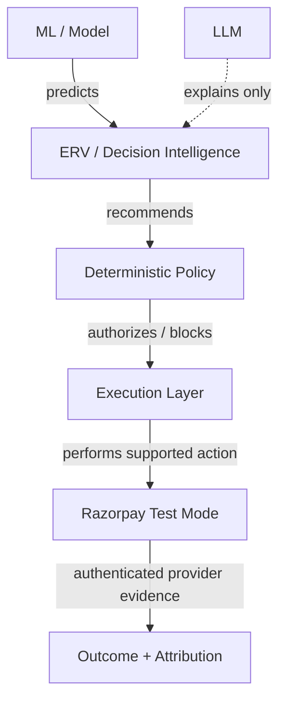
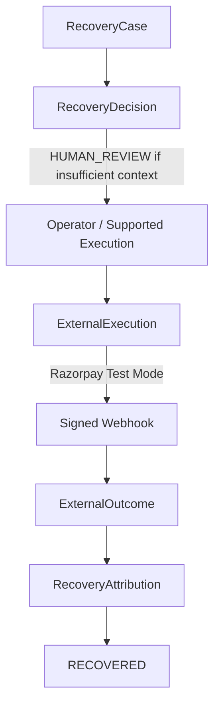

# RecoveryIQ

**Autonomous Revenue Recovery Control Plane for Razorpay-style payment workflows**

RecoveryIQ detects revenue at risk, estimates how recoverable a failed payment is, chooses the highest-value safe intervention under deterministic guardrails, executes only supported recovery workflows, verifies provider outcomes, and attributes recovered revenue exactly once.

A failed payment does not always mean "retry immediately."
The failure may come from customer liquidity issues, an expired payment instrument, issuer degradation, temporary network problems, mandate failure, or insufficient recovery context. 

RecoveryIQ decides whether to WAIT, RETRY, CREATE A PAYMENT LINK, SUGGEST AN ALTERNATE METHOD, REQUEST PAYMENT METHOD UPDATE, ESCALATE TO HUMAN, or STOP. But every financial action remains strictly bounded by deterministic policy.

---

## Razorpay AI Buildathon — Track 03 Alignment

The core Track 03 loop requires an AI to detect revenue at risk → determine the right intervention → execute a bounded recovery workflow → prove recovery.

| Track Requirement | RecoveryIQ Implementation |
| :--- | :--- |
| **Detect revenue risk** | Real-time tracking of failed subscription/one-time payments |
| **Degradation intelligence** | Payment Health tracks issuer and network failures over time |
| **Recovery prediction** | Action-conditioned ML estimation of recovery probability |
| **ERV optimization** | Ranks interventions by Expected Recovery Value |
| **Bounded policy** | Enforces a 48-hour horizon and absolute retry/contact limits |
| **Stopping rules** | Terminates on RECOVERED, STOP, or HUMAN_REVIEW limits |
| **Razorpay Test Mode** | Executes Payment Links where supported via the Test Mode API |
| **Signed webhooks** | Strict HMAC SHA-256 verification of Razorpay lifecycle events |
| **Exactly-once attribution** | Prevents duplicate simulated or test revenue attribution |
| **Simulated scaling** | A sealed batch of 27,406 episodes evaluated for recovery value |

---

## How RecoveryIQ Works

1. **Payment fails**: A transaction failure triggers the recovery lifecycle.
2. **Case correlation**: RecoveryIQ creates or correlates the failure to a `RecoveryCase`.
3. **Payment Health check**: The detector checks if the failure looks isolated to the customer or systemic to an issuer/method.
4. **Recovery Model**: Estimates recovery probability for each possible action.
5. **Expected Recovery Value (ERV)**: Evaluates the net economic value of each intervention.
6. **Deterministic policy**: Applies hard limits and safety constraints (contacts, retries, horizon).
7. **Action execution**: Supported action safely executes (e.g. Payment Link) or escalates/stops.
8. **Provider verification**: A Razorpay webhook event confirms the external result.
9. **Exactly-once attribution**: The recovered value is recorded exactly once in the database.
10. **Audit trail**: Every decision and mutation is appended to an immutable audit log.

---

## Conceptual Architecture

```mermaid
flowchart TD
    A[PAYMENT EVENT] --> B[Revenue Risk / Case]
    B --> C[Payment Health / Degradation]
    C --> D[Recovery Model V2]
    
    subgraph AI Layer
    D -.->|P(recovery \| action, context)| E[Expected Recovery Value]
    end
    
    E --> F[Sequential Policy V2 + Deterministic Guards]
    
    F --> G[Internal Action]
    F --> H[Razorpay Test Execution]
    F --> I[Human Review]
    
    H --> J[External Provider Event]
    J --> K[Signature Verification]
    K --> L[ExternalOutcome]
    L --> M[RecoveryAttribution]
    M --> N[Audit Trail]
```

---

## Authority Boundaries



**CRITICAL RULE**: The LLM acts exclusively in an **explanation only** capacity. It cannot authorize payment execution, change deterministic policy, or mark a payment as recovered.

---

## What Makes RecoveryIQ Different

### 1. Action-conditioned recovery prediction
It doesn't just ask "will this payment recover?" It asks "how likely is recovery *under each possible action*?"

### 2. Economic optimization with ERV
RecoveryIQ considers probability, recoverable revenue, intervention cost, and customer friction.

### 3. Degradation-aware recovery
It surfaces issuer, payment method, and systemic degradation evidence instead of blindly retrying every customer during an outage.

### 4. Deterministic financial guardrails
Model predictions and LLM generations cannot directly execute financial actions or bypass hard limits.

### 5. Bounded sequential recovery
Operates on a strict 48-hour horizon with concrete max intervention limits.

### 6. Exactly-once provider attribution
Provider Result → ExternalOutcome → RecoveryAttribution.

### 7. Adversarial reliability testing
Demonstrated 10-way duplicate webhook and concurrency verification.

### 8. Razorpay Test Mode lifecycle proof
Proves the integration loop out to Razorpay and back, not just in-memory simulation.

---

## Evidence Model

RecoveryIQ deliberately separates four distinct types of evidence to remain scientifically honest:

### DEMO · SYNTHETIC
**Purpose**: Judge-friendly operational cases used to demonstrate the Recovery Queue and Human Review behavior.
**Scale**: 5 cases totaling ₹2,75,999 Revenue at Risk.
*This is demo data. It is not provider revenue.*

### SEALED · SIMULATED
**Purpose**: Scientific evaluation of recovery performance over time.
**Scale**: 27,406 sealed episodes proving a 75.97% recovery rate and ₹4.72 Cr in simulated net recovery value.
*These are simulated evaluation results. They are not Razorpay revenue.*

### RAZORPAY · TEST MODE
**Purpose**: Provider lifecycle and integration evidence.
**Scale**: ₹2.00 all-time Test Mode recovery (₹1.00 in the last 7 days).
**Proves**: Signed webhook handling, payment link creation, outcome recording, and exactly-once attribution.
*No real money is moved. Do not present this as production revenue.*

### ISOLATED LOCAL VERIFICATION
**Purpose**: Reliability and financial safety evidence.
**Scale**: 10-way duplicate webhook and execution race testing.
**Proves**: Database constraint integrity, failure isolation, and duplicate execution prevention.
*This is executed on a temporary, isolated local database, separate from Razorpay Test Mode.*

---

## Verified Results

| Metric | Value | Evidence Type | What It Proves |
| :--- | :--- | :--- | :--- |
| Sealed episodes | 27,406 | SIMULATED | Scalability of the ML evaluation |
| Recovered episodes | 20,821 | SIMULATED | Model effectiveness |
| Recovery rate | 75.97% | SIMULATED | Base success metric |
| Simulated net recovery value | ₹4,71,96,320 | SIMULATED | Total captured economic value |
| Incremental simulated value vs Reminder + Retry | ₹1,44,07,440 | SIMULATED | Economic lift over standard baselines |
| Policy violations | 0 | SIMULATED | Deterministic guardrails are absolute |
| All-time Razorpay Test recovery | ₹2.00 | TEST MODE | E2E integration works successfully |
| 10-way duplicate webhook | 10 → 1 processed (9 deduplicated) | ISOLATED LOCAL | System resilience to retry storms |
| 10-way execution race | 10 invocations → 1 fake provider call | ISOLATED LOCAL | Idempotent execution layers |
| Duplicate financial effects | 0 | ISOLATED LOCAL | Exactly-once attribution correctness |

---

## Recovery Performance vs Baselines

RecoveryIQ's Sequential Policy balances recovery, contacts, intervention costs, and bounded policy constraints.

| Strategy | Incremental PP | Incremental Net Value |
| :--- | :--- | :--- |
| Reminder + Retry | Baseline | Baseline |
| RecoveryIQ (Sequential Policy) | + 22.88 pp | + ₹1,44,07,440 |

*Note: While naive probability policies might chase higher raw recovery rates, RecoveryIQ optimizes for Expected Recovery Value (ERV) to prevent friction burnout.*

---

## Expected Recovery Value (ERV)

Recovery probability alone is not enough. An action might have a high chance of success but also cost more, create customer friction, consume retry budget, or use contact limits. RecoveryIQ evaluates an economic score:

`ERV(action) ≈ [P(recovery | action, context) × recoverable amount] − intervention cost − friction cost`

---

## Recovery Model V2

- **Stack**: LightGBM
- **Capabilities**: Action-conditioned prediction, calibrated probabilities (isotonic calibration).
- **Integrity**: Frozen feature schema, held-out validation, no hidden simulator ground truth given to the policy/model.
- **Current Versions**: Model `2.0.0`, Feature Schema `2.0`, Policy `2.0.0`.

---

## Degradation Intelligence

A failed payment may represent an individual customer problem OR a broader issuer/payment-method degradation. RecoveryIQ analyzes risk at the **Global**, **Issuer**, and **Payment Method** levels.

Evidence tiers: `HEALTHY`, `WATCH`, `CONFIRMED`.

*Detector V2 is intentionally retained as an advisory observability layer; it cannot autonomously authorize or modify recovery actions. It did not pass the hard-policy gate required for autonomous policy authority.*

---

## Bounded Recovery Policy

Automation risk is mitigated by deterministic bounds:
- **Horizon**: 48-hour recovery window.
- **Maximum Interventions**: 3
- **Maximum Retries**: 2
- **Maximum Contacts**: 2
- **Termination States**: `RECOVERED`, `STOP`, `HUMAN_REVIEW`

This prevents retry storms, reduces customer friction, limits automation risk, and keeps financial automation entirely predictable.

---

## Financial Safety & Exactly-Once Guarantees

RecoveryIQ enforces database-level guarantees using strict `UNIQUE` constraints:
- `ExternalWebhookEvent.provider_event_id`
- `ExternalExecution.execution_plan_id`
- `ExternalExecution.idempotency_key`
- `ExternalExecution.provider_reference_id`
- `ExternalOutcome.webhook_event_id`
- `ExternalOutcome.external_payment_id`
- `RecoveryAttribution.recovery_case_id`
- `RecoveryAttribution.external_outcome_id`

**Guarantees:**
- 10 concurrent identical webhook requests → 1 logical provider event.
- 10 concurrent execution attempts → 1 logical execution → 1 fake provider call.
- Provider success → 1 ExternalOutcome → 1 RecoveryAttribution.

---

## Reliability Boundaries

- **PROVEN**: Database-level duplicate prevention, webhook deduplication, local execution reservation, outcome uniqueness, attribution uniqueness.
- **PARTIALLY PROTECTED**: Provider accepted request but local process crashes before response persistence. Mitigation: provider reference/reconciliation.
- **NOT IMPLEMENTED**: Automatic stale execution-reservation reaper.
- PostgreSQL is architecturally compatible but not concurrency-tested in this demo (SQLite is used for the verified demo).
- WAL is not required for current logical exactly-once invariants.

---

## Razorpay Integration

RecoveryIQ uses Razorpay Test Mode to prove lifecycle handling:
1. **Payment failure** → Recovery case created.
2. **Policy decision** → `HUMAN_REVIEW` (if insufficient context).
3. **Execution** → `OPERATOR_INITIATED` Payment Link.
4. **Outcome** → Later success triggers authenticated provider webhook.
5. **Verification** → Raw-body HMAC SHA-256 verification via `X-Razorpay-Signature`.
6. **Persistence** → `ExternalOutcome` → `RecoveryAttribution` → `RECOVERED`.

*Order-ID Correlation Hardening*: Provider failures may not always carry a `subscription_id`. RecoveryIQ maps `payment.order_id` → `ExternalExecution` → `RecoveryCase` to prevent duplicate case creation.

### Evidence Diagram


*Razorpay Test evidence proves integration correctness, not production-scale recovery.*

---

## Where the LLM Is Used

The boundary of LLM authority is strict.

**The LLM CAN:**
- Generate structured explanation and summaries of supplied evidence.
- Explain decisions based on context.

**The LLM CANNOT:**
- Choose the final financial action.
- Change policy bounds.
- Create arbitrary Razorpay executions.
- Mark a payment as recovered.
- Modify attribution or override stopping rules.

*(Current verified explanation provider: Groq fallback)*

---

## Batch Explorer

The Batch Explorer provides portfolio-level analysis across the sealed simulated evaluation (27,406 episodes). It analyzes dimensions like Failure Reason, Payment Method, Amount Bucket, Prior Success, and Subscription Tenure.

It demonstrates scale without contaminating operational demo data (no cross-dimensional fabricated analytics or cohort-level revenue-at-risk numbers are hallucinated).

---

## Product Surfaces

- **Command Center**: The primary control plane showing headline impact and active pipelines.
- **Payment Health**: Real-time issuer and network degradation intelligence.
- **Recovery Queue**: Operational demo synthetic cases (and any Test Mode anomalies).
- **Decision Trace**: Explanations of why RecoveryIQ chooses one action over another.
- **Safety Lab**: adversarial duplicate-webhook and concurrency execution testing results.
- **Batch Explorer**: Deep-dive dimensional analysis of the 27,406 sealed simulated episodes.
- **Razorpay**: Provider integration health, webhooks, and exactly-once lifecycle attributions.
- **Evaluation Lab**: Simulated model metrics vs traditional baselines.

---

## Suggested 5-Minute Demo

1. **Command Center**: "Here are the three evidence types and headline impact."
2. **Evaluation Lab / Batch Explorer**: "Here is sealed simulated recovery vs baselines at portfolio scale."
3. **Decision Trace**: "Here is why RecoveryIQ chooses one action over another."
4. **Payment Health**: "Here is why blindly retrying can be wrong during degradation."
5. **Safety Lab**: "Here is 10-way concurrency collapsing to one logical effect."
6. **Razorpay**: "Here is the authenticated provider lifecycle and exactly-once attribution."

---

## Installation

RecoveryIQ is designed to run locally using SQLite for verified demo purposes.

### Backend (FastAPI)
```bash
cd apps/api
uv sync --dev --locked
uv run alembic upgrade head
uv run fastapi run app/main.py --port 8000
```

### Frontend (Next.js)
```bash
cd apps/web
npm ci
npm run dev
```

---

## Environment Variables

*Razorpay credentials must be TEST MODE. No real credentials should be committed.*
Copy the `.env.example` file and configure variables like:
- `RAZORPAY_KEY_ID`
- `RAZORPAY_KEY_SECRET`
- `RAZORPAY_WEBHOOK_SECRET`
- `GROQ_API_KEY`
- `NEXT_PUBLIC_API_BASE_URL`

---

## Verification

The project enforces strict quality standards, backed by a robust test suite.

```bash
# Backend Quality (87 tests)
cd apps/api
uv run ruff check .
uv run mypy app tests
uv run pytest

# Frontend Quality
cd apps/web
npm run lint
npm run typecheck
npm run build
```

GitHub Actions guarantees green CI runs across **Simulator quality**, **Backend quality**, and **Frontend quality**.

---

## Repository Structure

```text
RecoveryIQ/
├── apps/
│   ├── api/          # FastAPI backend, routers, and DB models
│   └── web/          # Next.js frontend and React components
├── artifacts/
│   ├── detector_v2/  # Frozen degradation intelligence metadata
│   ├── model/        # Frozen V2 recovery models
│   ├── policy/       # Frozen V2 policy schemas
│   └── demo/         # Synthetic operational test cases
├── docs/             # Internal architecture and evaluation notes
├── simulator/        # Recovery generation and simulated environment
├── ml/               # Training notebooks and data extraction
└── .github/          # CI/CD and GitHub Actions workflows
```

---

## Technology Stack

| Category | Technologies |
| :--- | :--- |
| **Backend** | Python 3.12, FastAPI, Pydantic v2, SQLAlchemy |
| **Frontend** | Next.js, React, TypeScript |
| **ML & Evaluation** | LightGBM, scikit-learn, SHAP, NumPy, pandas |
| **Provider** | Razorpay Test Mode |
| **LLM** | Groq explanation layer |
| **Persistence** | SQLite |
| **Testing** | pytest, Hypothesis |
| **CI** | GitHub Actions |

---

## Current Limitations

- Razorpay Test Mode only.
- No real money is moved.
- The sealed batch evaluation is simulated.
- Payment Health evidence is simulated.
- Detector V2 remains advisory only.
- The safety race harness uses a fake provider & local isolated verification.
- PostgreSQL concurrency is not tested in this demo.
- Automatic stale execution reservation reaper is not implemented.
- Some actions are recommendation-only/internal scheduling.
- The LLM is strictly explanation-only.
- No production deployment is claimed.

---

## What This Demo Does Not Claim

- It does not claim ₹4.72 Cr was actually recovered through Razorpay (it is simulated).
- It does not claim the ₹2.00 Test Mode amount represents production revenue.
- It does not claim detector signals autonomously execute payments.
- It does not claim the LLM controls financial actions.
