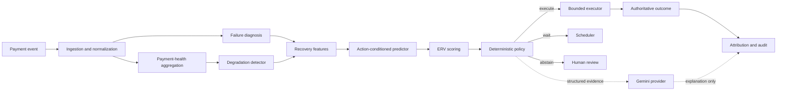
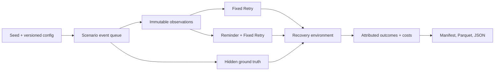
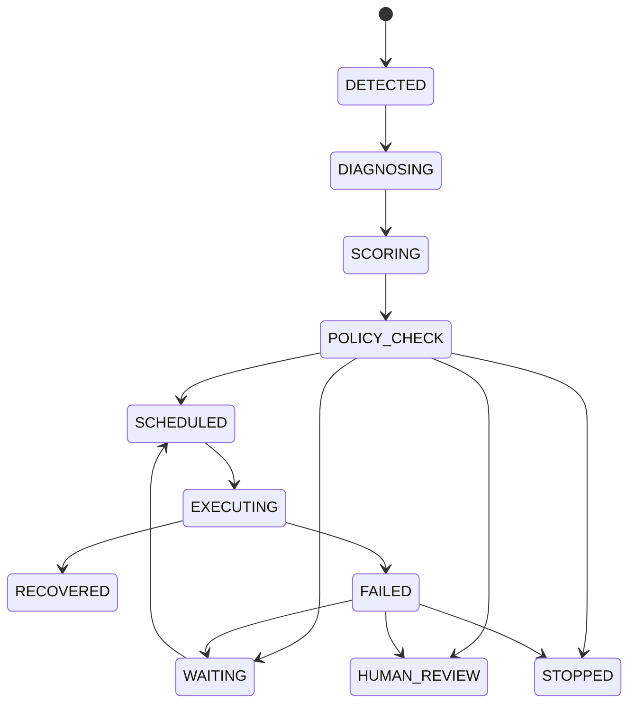

# RecoverIQ Architecture

## System shape

RecoverIQ separates evidence production, authorization, execution, and explanation. Statistical and ML components will produce evidence; a deterministic policy engine will authorize bounded actions; executors will perform those actions; Gemini may explain already-computed evidence. The database and verified payment-provider events remain the financial system of record.

The foundation and standalone simulator/baselines are implemented through Phase 2. Detection, ML, intelligent policy, execution adapters, and operational UI remain future commitments.

## Simulator/environment boundary

The Phase 2 simulator is a standalone uv package. It does not import the API, frontend, Gemini provider, Razorpay code, or future ML code.

`PaymentObservation` contains only information already delivered by the simulation clock. An exact field allowlist rejects unreviewed schema growth. Hidden customer characteristics, instrument state, true cause, incident state, and response probabilities remain behind `RecoveryEnvironment`. Policy protocols accept observations, not the combined scenario.

Equivalent actions use SHA-256-keyed draws over semantic identifiers rather than a mutable evaluation RNG. Policy naming, logging, ordering, cost changes, or unused post-stop candidates cannot perturb unrelated outcomes. Attribution remains single-use per payment.

Generated evidence is rooted under `observable/`; incident and outcome truth is rooted under `ground_truth/`. No all-in-one training table exists. A future supervised dataset builder must deliberately join approved targets while preserving this boundary.

## Domain boundaries

- **Ingestion:** validates provenance, signature, schema, correlation, and idempotency before dispatch.
- **Payments:** owns normalized merchant, customer, subscription, payment, and attempt records.
- **Health:** owns rolling aggregates and degradation incidents.
- **Recovery:** owns recovery cases, candidate scores, state transitions, policy results, and scheduling.
- **Execution:** owns idempotent provider calls and customer-contact side effects.
- **Attribution:** owns the single authoritative link between a recovery workflow and a successful outcome.
- **AI enrichment:** owns optional structured explanations and investigations; it owns no financial state.
- **Audit:** records actor, correlation, event type, entity, timestamp, and safe structured metadata.

Domain services will not depend on FastAPI request objects, Celery task objects, or Gemini SDK types.

## Foundation data model

Phase 1 creates only `Merchant`, `Customer`, `Subscription`, `Payment`, `PaymentAttempt`, `RecoveryCase`, and `AuditEvent`. Internal identifiers are UUIDs. External provider identifiers are optional and separately unique where appropriate. Monetary amounts use integer minor units. Timestamps are generated in UTC. The `RecoveryCaseStatus` enum declares the intended lifecycle without prematurely implementing transition policy.

The diagram is the intended high-level lifecycle. A later milestone will define legal transitions, retry limits, terminal-state invariants, and concurrency control in executable domain code.

## Database strategy

The backend uses synchronous SQLAlchemy 2 sessions throughout FastAPI routes, Alembic migrations, and Celery tasks. This avoids maintaining two persistence paths during the foundation phase and matches Celery's synchronous task model. FastAPI executes synchronous endpoints in its worker thread pool. If measured request concurrency later demands async database I/O, that change will be made behind repositories rather than mixing session types.

Local development defaults to `sqlite:///./recoveriq.db`. Tests use isolated SQLite databases. Full environments configure `postgresql+psycopg://...`. Models use portable SQLAlchemy types and avoid SQLite-specific functions, conflict syntax, and schema assumptions. PostgreSQL remains the production target for row locking, concurrent workers, stronger operational controls, and JSON/index capabilities.

Alembic is the only supported schema evolution path. Application startup checks connectivity but does not silently run migrations.

## Background execution strategy

Celery remains the background-job boundary in every environment. Local development and tests set `CELERY_TASK_ALWAYS_EAGER=true`, use memory transport/backend, and execute tasks synchronously. Full environments set eager mode false and use Redis as broker and result backend. Task definitions must remain serializable, idempotent, and safe under retries; eager mode must not become a separate implementation.

## API and frontend boundary

FastAPI exposes typed JSON under an HTTP boundary. The Next.js App Router frontend consumes the API using `NEXT_PUBLIC_API_BASE_URL`; its build does not require a running backend. Runtime connectivity is shown explicitly as connected, unavailable, or not yet checked. The UI must not synthesize financial metrics when the API has no data.

## Gemini boundary

Application code depends on an `LLMProvider` protocol. `GeminiLLMProvider` contains SDK-specific behavior, `FakeLLMProvider` provides deterministic tests, and `DeterministicFallbackProvider` keeps explanations available without network access. Providers return Pydantic-validated structures. They cannot mutate payment state, authorize actions, or determine outcomes. Gemini is never called automatically during startup.

## Future Razorpay adapter

A future adapter will operate in Razorpay Test Mode only. It will validate webhook HMAC signatures over raw request bytes, persist provider event IDs, acknowledge quickly, and dispatch idempotent background processing. Duplicate or out-of-order events must not duplicate recovery cases, links, retries, contacts, or attribution. No Razorpay API call exists through Phase 2.

## Audit architecture

`AuditEvent` is append-oriented and stores a correlation UUID, entity reference, actor, event type, UTC timestamp, and redacted JSON metadata. Domain services—not UI prose and not Gemini—will emit audit events at transaction boundaries. Secrets, request headers, raw payment payloads, PAN, CVV, OTP, and unnecessary PII are forbidden from metadata. A later milestone will add transactionally consistent audit creation and retention rules.
