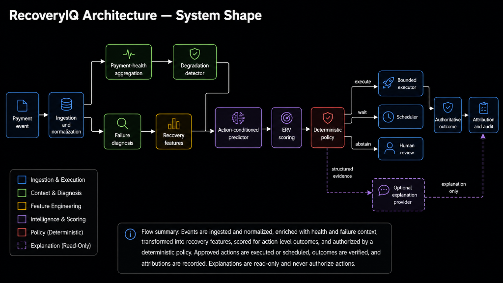
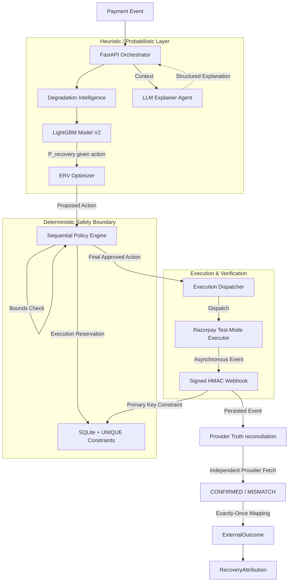
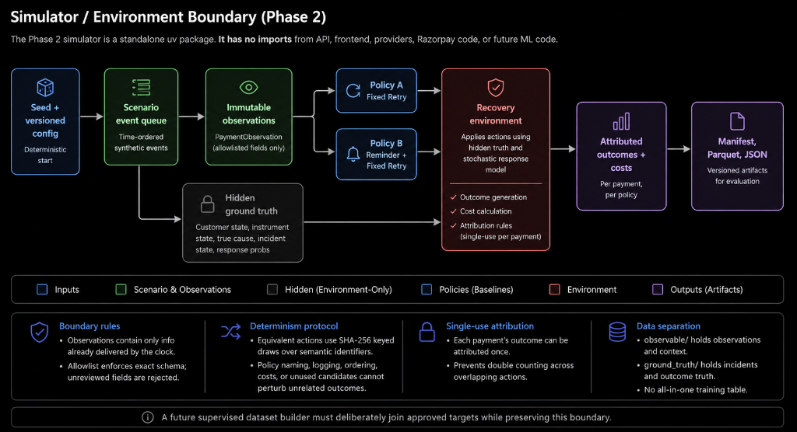
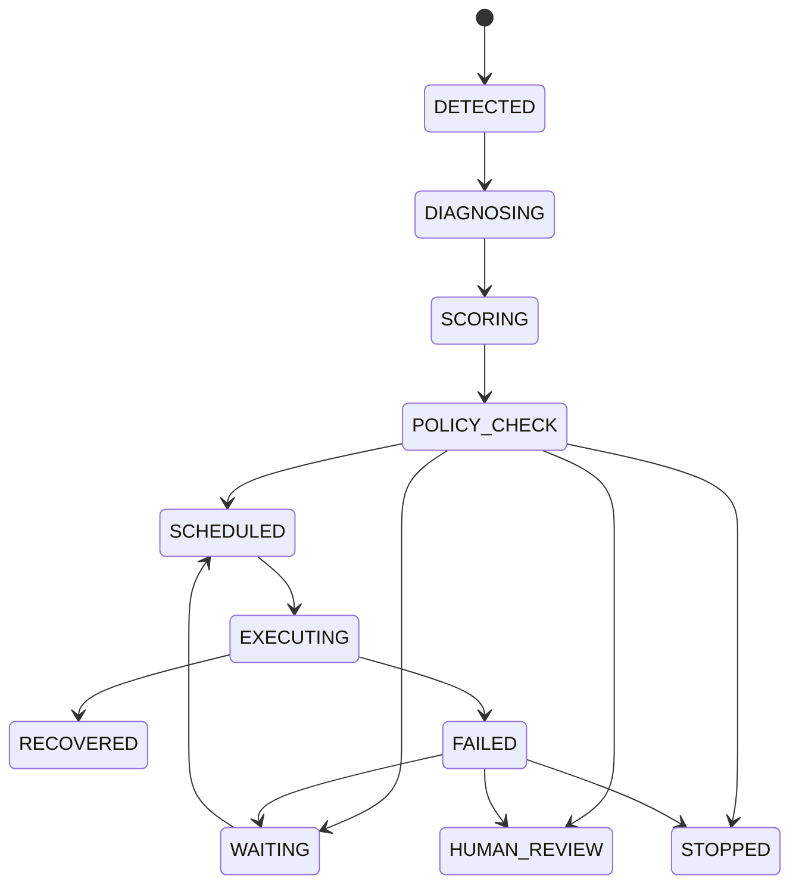

# RecoverIQ Architecture

## System shape

RecoverIQ separates evidence production, bounded sequential authorization, execution, and explanation. Statistical and ML components produce action-level evidence; a deterministic policy engine authorizes at most three adaptive interventions; executors perform those actions; an optional Groq provider explains only already-computed evidence. The database and verified payment-provider events remain the financial system of record.

The final submission includes the simulator/model/policy stack, explanation boundary, Razorpay Test Mode integration, operator UI, Provider Truth Triangulation, Recovery Governance Profile, Recovery Proof Record, and Critical Financial Path Gate. Live Mode and broader autonomous provider execution remain out of scope.

## Control Plane & Authority Boundaries

The system is strictly divided into three layers: a probabilistic intelligence layer, a deterministic safety boundary, and a verified execution layer.

**CRITICAL RULE**: The LLM acts exclusively in an **explanation only** capacity. It cannot authorize payment execution, change deterministic policy, or mark a payment as recovered.

## Simulator/environment boundary

The Phase 2 simulator is a standalone uv package. It does not import the API, frontend, explanation providers, Razorpay code, or future ML code.

`PaymentObservation` contains only information already delivered by the simulation clock. An exact field allowlist rejects unreviewed schema growth. Hidden customer characteristics, instrument state, true cause, incident state, and response probabilities remain behind `RecoveryEnvironment`. Policy protocols accept observations, not the combined scenario.

Equivalent actions use SHA-256-keyed draws over semantic identifiers rather than a mutable evaluation RNG. Policy naming, logging, ordering, cost changes, or unused post-stop candidates cannot perturb unrelated outcomes. Attribution remains single-use per payment.

Generated evidence is rooted under `observable/`; incident and outcome truth is rooted under `ground_truth/`. No all-in-one training table exists. A future supervised dataset builder must deliberately join approved targets while preserving this boundary.

## Domain boundaries

- **Ingestion:** validates provenance, signature, schema, correlation, and idempotency before dispatch.
- **Payments:** owns normalized merchant, customer, subscription, payment, and attempt records.
- **Health:** owns rolling aggregates and degradation incidents.
- **Recovery:** owns recovery cases, candidate scores, state transitions, policy results, and scheduling.
- **Execution:** owns idempotent provider calls and customer-contact side effects.
- **Attribution:** owns the single authoritative link between a recovery workflow and a successful outcome.
- **AI enrichment:** owns optional structured explanations and investigations; it owns no financial state.
- **Audit:** records actor, correlation, event type, entity, timestamp, and safe structured metadata.

Domain services will not depend on FastAPI request objects, Celery task objects, or remote-provider SDK types.

## Foundation data model

Phase 1 creates only `Merchant`, `Customer`, `Subscription`, `Payment`, `PaymentAttempt`, `RecoveryCase`, and `AuditEvent`. Internal identifiers are UUIDs. External provider identifiers are optional and separately unique where appropriate. Monetary amounts use integer minor units. Timestamps are generated in UTC. The `RecoveryCaseStatus` enum declares the intended lifecycle without prematurely implementing transition policy.

The diagram is the intended high-level lifecycle. A later milestone will define legal transitions, retry limits, terminal-state invariants, and concurrency control in executable domain code.

## Database strategy

The backend uses synchronous SQLAlchemy 2 sessions throughout FastAPI routes, Alembic migrations, and Celery tasks. This avoids maintaining two persistence paths during the foundation phase and matches Celery's synchronous task model. FastAPI executes synchronous endpoints in its worker thread pool. If measured request concurrency later demands async database I/O, that change will be made behind repositories rather than mixing session types.

Local development defaults to `sqlite:///./recoveriq.db`. Tests use isolated SQLite databases. Full environments configure `postgresql+psycopg://...`. Models use portable SQLAlchemy types and avoid SQLite-specific functions, conflict syntax, and schema assumptions. PostgreSQL remains the production target for row locking, concurrent workers, stronger operational controls, and JSON/index capabilities.

Alembic is the only supported schema evolution path. Application startup checks connectivity but does not silently run migrations.

## Background execution strategy

Celery remains the background-job boundary in every environment. Local development and tests set `CELERY_TASK_ALWAYS_EAGER=true`, use memory transport/backend, and execute tasks synchronously. Full environments set eager mode false and use Redis as broker and result backend. Task definitions must remain serializable, idempotent, and safe under retries; eager mode must not become a separate implementation.

## API and frontend boundary

FastAPI exposes typed JSON under an HTTP boundary. The Next.js App Router frontend consumes the API using `NEXT_PUBLIC_API_BASE_URL`; its build does not require a running backend. Runtime connectivity is shown explicitly as connected, unavailable, or not yet checked. The UI must not synthesize financial metrics when the API has no data.

## Payment-health detection boundary

`simulator/recoveriq_detector/detector.py` remains the frozen v1 research/statistical benchmark. The separate `simulator/recoveriq_detector_v2/` package contains the Phase 3.5 online component. Its update interface accepts only narrow observable payment-result events and exposes versioned `PaymentHealthContextV2` values. Simulator-specific replay and evaluation adapters are separate modules. Only evaluation imports hidden incident truth, and it does so after detector predictions have been generated.

V2 keeps issuer, payment-method, and global state distinct. Parent state may corroborate issuer evidence but cannot open or confirm an issuer episode without a local likelihood boundary and local volume. WATCH is explicitly advisory. The pre-registered validation safety gate failed, so the frozen V2 CONFIRMED signal is also advisory-only; architecture and context types expose no hard-policy permission. No recovery action, recovery model, payment-provider integration, or UI authority was added in Phase 3.5.

## Recovery-model boundary

Phase 4 introduces a separate action-conditioned prediction package. Its versioned `RecoveryFeatureSnapshot` is constructed only from public payment observations, preceding observable history, prior logged interventions whose execution time has arrived, and frozen detector-V2 snapshots through decision time. Raw entity IDs, seeds, hidden incident/cause/state fields, and unselected counterfactual outcomes are outside the model boundary.

A randomized exploration logger selects and executes one feasible action per failed payment and records its propensity. Model training therefore resembles logged intervention data rather than a fully revealed counterfactual table. Hidden simulator response probabilities remain environment-owned and may be used only after frozen predictions for held-out ranking diagnostics.

The shared logistic and LightGBM models estimate a 48-hour action-conditioned recovery probability. Calibration is a distinct artifact fitted on its own seeds. SHAP is structured explanatory evidence only. Recovery Model V1 completed its registered held-out evaluation with both probability/ranking gates passing. The health-free ablation nevertheless performed slightly better on most primary metrics, so no architectural authority is inferred from health features and no detector threshold changed. Phase 4 performs no expected-value calculation, policy choice, financial authorization, execution integration, or UI mutation. Frozen detector-V2 WATCH and CONFIRMED values remain advisory features, never policy authority or truth labels.

## Recovery-policy boundary

Phase 5 adds a separate typed first-intervention policy package. Observable context produces nine deterministic candidate actions; frozen calibrated Model V1 probabilities feed exact integer-minor ERV scores; structured feasibility, support, non-positive-value, and decision-margin rules then produce ACTION, HUMAN_REVIEW, or STOP. Candidate generation, model scoring, economics, hard policy, selection, and audit explanation remain separate layers. Neither detector state nor hidden simulator truth is a hard policy input.

The policy package cannot import the evaluation oracle or simulator ground truth. The evaluation adapter alone joins hidden action outcomes after decisions, applies single-attribution semantics, and compares paired strategies. Policy V1 has no executor: ACTION is a simulated first intervention, while HUMAN_REVIEW and STOP have no autonomous side effect. Existing multi-action Phase 2 workflows are retained as a distinct secondary comparison rather than mixed into the equivalent first-action headline.

The one-time Policy V1 validation passed its frozen safety/value gates, but architecture does not infer production readiness. The exact no-health research policy outperformed the frozen primary again, and the existing multi-action Reminder + Retry workflow outperformed the first-action policy. Those results constrain future model and repeated-decision work; they do not authorize a post-validation model switch or broader action loop.

## Bounded sequential-recovery boundary

Phase 6 adds a new simulator-adapter environment rather than modifying Simulator `0.3.0`. An episode has a fixed 48-hour horizon and terminates on recovery, STOP, HUMAN_REVIEW, horizon, or three autonomous interventions. Every decision receives only prior observable episode state; one feasible action is executed and its outcome is finalized before state advances. Recovery attribution belongs to exactly one current action.

Recovery Model V2 is a new tabular action-conditioned model for these trajectory states. Its primary feature schema explicitly excludes every Detector V2/payment-health field as well as hidden state, raw IDs, and seeds. Detector V2 remains a separate advisory operational-observability component. Sequential Policy V2 uses calibrated action-level probability, exact incremental ERV, and deterministic limits in a bounded greedy replanning loop. Reinforcement learning and neural sequence models are intentionally outside this phase.

The implementation keeps four concrete authority boundaries: `recoveriq_sequential` owns observable episode state, feasibility, timing, and attribution; `recoveriq_ml_v2` owns logging, the frozen feature boundary, model/calibration, and held-out scoring; `recoveriq_sequential_policy` owns deterministic scoring/rules and baseline selection; only its evaluation module may instantiate the hidden simulator oracle. Model and policy artifacts bind schema/model/calibrator/baseline hashes. Registered held-out and validation entry points write attempt markers before world generation and refuse rerun.

The sealed Phase 6 evaluation confirmed that later-state model quality remained supported and that all seven strategies saw the same per-seed initial-cohort digest. This is simulator evidence, not production authority: no executor, LLM call, Razorpay adapter, frontend control, or external side effect was added.

## Explanation-provider boundary

Application code depends on an `ExplanationProvider` protocol. `GroqExplanationProvider` is the optional primary OpenAI-compatible adapter, `FakeLLMProvider` provides deterministic tests, and `DeterministicFallbackProvider` keeps explanations available without network access. Providers return Pydantic-validated structures with no authority fields. They cannot mutate payment state, authorize actions, call Razorpay, or determine outcomes, and no remote provider is called automatically during startup.

## Razorpay Test Mode execution boundary

Phase 7 adds an isolated `RazorpayGateway` and no Live Mode. `SIMULATION` is the default execution environment; `RAZORPAY_TEST` is explicit, `RAZORPAY_MODE` accepts only `test`, and credentials remain optional at startup. The adapter uses documented Payment Link create/fetch operations and raw-body HMAC-SHA256 webhook verification. Normal tests use a deterministic fake gateway and sanitized official-shape fixtures.

The webhook request path validates the signature before JSON parsing, durably deduplicates `x-razorpay-event-id`, stores only a checksum/safe entity IDs/redacted Test Mode payload, then dispatches processing. Non-eager Celery mode preserves fast acknowledgement; eager development mode invokes the identical service inline. Per-entity provider timestamps reject stale subscription regressions, while unique database constraints protect provider events, execution keys/references/entities, and attribution.

Decision, capability, side effect, and outcome are separate persisted concepts. `CREATE_PAYMENT_LINK` is the only Phase 7 `REAL_TEST_EXECUTION`; retries are internal schedules and customer-facing actions are recommendations. The provider request is preceded by a durable unique execution. Ambiguous create outcomes remain `UNKNOWN` and reconcile by documented Payment Link ID/reference lookup without issuing a replacement.

A first Razorpay failure does not contain provably complete historical inputs for frozen Model V2. `RazorpayContextAdapter` therefore records explicit missing requirements and routes to `HUMAN_REVIEW / INSUFFICIENT_CONTEXT` instead of fabricating zero values. An explicit `OPERATOR_INITIATED` Test Link is a separately audited fallback. A verified link payment can attribute exactly one `RAZORPAY_TEST` recovery after link/reference/note/amount/currency/status checks, but it never claims to repair the original Subscription. See [Razorpay Integration](RAZORPAY_INTEGRATION.md).

## Audit architecture

`AuditEvent` is append-oriented and stores a correlation UUID, entity reference, actor, event type, UTC timestamp, and redacted JSON metadata. Domain services—not UI prose and not an explanation provider—emit audit events at transaction boundaries. Secrets, request headers, raw payment payloads, PAN, CVV, OTP, and unnecessary PII are forbidden from metadata. A later milestone will add retention rules for longer-lived environments.

## Deterministic Recovery Proof Record

RecoveryIQ includes a Deterministic Recovery Proof Record system. It maps disparate persisted evidence models including \RecoveryCase\, \RecoveryDecisionRecord\, \ExternalExecution\, \ExternalOutcome\, and \RecoveryAttribution\ into a single read-only view. 

The Proof Record categorizes the evidence lane (e.g. \DEMO_SYNTHETIC\ vs \RAZORPAY_TEST_MODE\) and computes a canonical SHA-256 fingerprint. This fingerprint is a deterministic hash of the non-secret evidence fields, designed to answer the question: 'What evidence supports this recovery decision, execution, provider outcome, and attribution?' It is not a blockchain or cryptographic proof, but rather a transparent checksum of the data at read time.

## Recovery Proof Record

To address external audit requirements and maintain transparency, RecoveryIQ provides a Deterministic Recovery Proof Record. The Proof Record aggregates the independent components of a recovery lifecycle (decision, execution, outcome, attribution, and provider evidence) into a single read-only view. 

The Proof Record does NOT use blockchain, cryptographic immutability, digital signatures, non-repudiation, or provider-signed proofs. It computes a SHA-256 fingerprint of the canonical non-secret included evidence fields. 

The fingerprint changes when included canonical evidence fields change. Detecting a change requires comparison with a previously recorded fingerprint.
